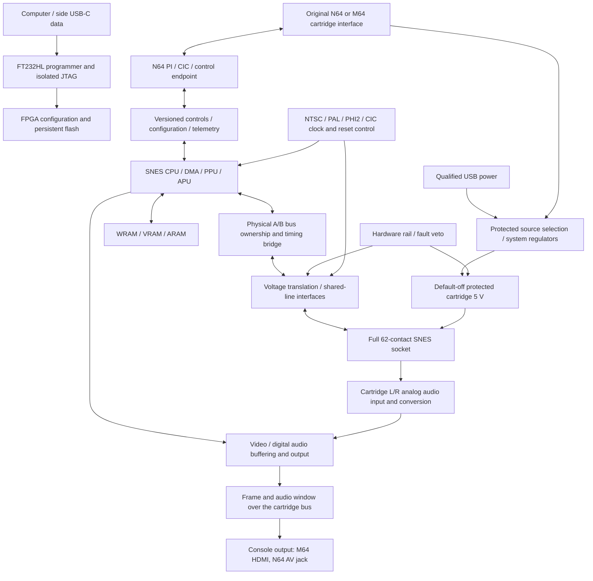

# SN64 architecture and current implementation boundary

Engineering snapshot: 2026-09-29. The target is one adapter for original Nintendo 64 and ModRetro M64, with a complete physical SNES/SFC cartridge interface and independent recovery through the side USB-C data port. The [requirements register](requirements.md) and [acceptance matrix](../test/acceptance-matrix.csv) retain the complete specification. **A console-core resource/simulation candidate exists; a completed SN64 board, physical cartridge bridge and hardware compatibility do not.**

## Whole-product blocks

The arrows describe the intended system, not completed circuitry. The current block status is:

| Block | Existing evidence | Work still required |
|---|---|---|
| SNES logic and local memory | Pinned source subset, generated interface patches, synthesizable candidate and original diagnostic program. | PPU/APU/gameplay, timing, reset and compatibility validation; physical bridge integration. |
| SNES socket | Verified 62-contact map and reference footprint. | Exact socket sample/drawing qualification, translator circuitry, protected power, clocks, CIC, analog audio and physical bus implementation. See [socket selection](design/socket-selection.md) and [bridge design](design/physical-cartridge-bridge.md). |
| N64/M64 host endpoint | Pinned SummerCart64 PI/SI/CIC source and connector evidence. | Adapt and test the endpoint, bootstrap and versioned controls/configuration/telemetry protocol. Host reset and SNES reset require separate ownership. See [host interface notes](design/n64-interface-notes.md). |
| USB programming | KiCad FT232HL/MPSSE circuit with default-disabled JTAG isolation. | Blank-safe target power, exact FPGA/flash hookup, persistent-image programming, failed-update recovery and cold-boot tests. See [programming architecture](design/usb-programming-architecture.md). |
| Power/protection | Source budgets and component candidates, with unknown loads explicitly retained. | Full current/transient/thermal budget, rail sequencing, fault circuitry and measurements. Host-only play feasibility remains unresolved; no direct supply paralleling. See [power architecture](design/power-architecture.md). |
| Clocks, A/V and cartridge audio | Core RGB/timing and audio sample ports. | Oscillator/PLL implementation, regional timing, output transport, cartridge analog input conditioning/conversion/mixing, synchronization and measured latency. |
| Board and enclosure | Connector/USB circuit drafts and source-derived mechanical references. | Whole-system pin/bank allocation, PCB layout, qualified socket, complete enclosure, cable clearance and both-host fit. |

The host bootstrap will supply controller state and configuration while the FPGA runs SNES timing. Its proposed control protocol must retain buttons and analog axes, a version/build identity, stale-input handling, reset/fault status and update compatibility. No multitap is selected. Deferred virtual mouse support still needs an update path and justified capacity; lightgun support remains undecided. No throughput or latency acceptance is inferred from the block diagram.

The SNES picture and sound go to the console as frame data over the cartridge bus (PI domain 2) and the boot program shows them on the console's own output: the M64's HDMI, an original N64's AV jack ([console-video-path.md](design/console-video-path.md)). The board has no video output of its own (its HDMI port was removed on 2026-09-29). M64's reserved contacts stay isolated.

## Core reuse comparison

| Source and inspected revision | Useful reusable work | SN64 decision and limitation |
|---|---|---|
| [nand2mario/SNESTang](https://github.com/nand2mario/snestang/tree/5f0ef193145f67bded7f73f2c477ac8da4d85f7e), `5f0ef193145f67bded7f73f2c477ac8da4d85f7e` | Verilog/SystemVerilog CPU, PPU, APU and DMA; portable inferred PPU-memory branches. | Current bounded candidate. Its selected console subset builds with the evaluated Windows tools. Exclude the board wrapper, ROM loader, soft MCU and emulated cartridge maps; physical cartridges must retain responsibility for ROM, save RAM and enhancement logic. |
| [MiSTer SNES](https://github.com/MiSTer-devel/SNES_MiSTer/tree/c61bfd45171c62000417333cd4679890bcd091a6), `c61bfd45171c62000417333cd4679890bcd091a6` | Existing console implementation, compatibility fixes and a broader source reference. | Continue using as a behavioral/reference source. Its [main module](https://github.com/MiSTer-devel/SNES_MiSTer/blob/c61bfd45171c62000417333cd4679890bcd091a6/rtl/main.v) and platform wrapper contain mapped ROM/save interfaces and emulated cartridge chips; these are not physical socket ports. No equivalent SN64 ECP5 build was measured for this snapshot. |
| [m1nl/SNESTang MiSTle fork](https://github.com/m1nl/snestang/tree/c84161d134c35c15d45aeabcef3b40cbe55cf3ef), `c84161d134c35c15d45aeabcef3b40cbe55cf3ef` | Current `mistle` head inspected on 2026-09-29: ECP5/IcePi-Zero integration, SERV/QERV I/O, mixed VHDL/Verilog core, memory/HDMI/audio adaptation. | Strong portability/comparison candidate, not adopted into this build. The [README](https://github.com/m1nl/snestang/blob/c84161d134c35c15d45aeabcef3b40cbe55cf3ef/README.md) calls the port work in progress. Inspected [SNES.vhd](https://github.com/m1nl/snestang/blob/c84161d134c35c15d45aeabcef3b40cbe55cf3ef/src/SNES.vhd) and [main.v](https://github.com/m1nl/snestang/blob/c84161d134c35c15d45aeabcef3b40cbe55cf3ef/src/main.v) retain console internals behind a mapped ROM/BSRAM cartridge path; a physical bridge is still required. Its mixed-language build needs separate toolchain/resource validation. |

The current selection establishes a reproducible starting point, not superiority over the other cores or full cartridge compatibility. Evaluate an alternative against the same memory configuration, diagnostic tests and physical-bus contract before comparing area or timing. Reuse upstream fixes with a recorded diff and regression evidence.

The [vendored provenance](../fpga/vendor/snestang/provenance.json) records the upstream commit, archive hash and hashes for 35 selected files. The retained [LICENSE](../fpga/vendor/snestang/LICENSE) contains GPL version 3; preserve file notices and identify adaptations in distribution records. Hardware and firmware reference licenses are tracked separately in the [reuse record](research/reusable-designs.md) and hardware notices. The original project diagnostic contains no commercial game ROM.

## Candidate implementation

[sn64_console_candidate.sv](../fpga/rtl/sn64_console_candidate.sv) instantiates the SNES subsystem and byte-wide synchronous RAM. [prepare_core.py](../fpga/tools/prepare_core.py) verifies vendored hashes and writes generated copies, leaving upstream files unchanged. It removes diagnostic print statements, exports PHI2 and HIGH_RES, ties the unconnected TURBO input low, and exports the CPU/DMA/HDMA-selected raw address before internal WRAM mirror canonicalization. Generated-file hashes and interface changes are recorded in `build/core-preparation.json`.

| Memory | Candidate capacity | Baseline mapped DP16KD blocks |
|---|---:|---:|
| WRAM | 128 KiB | 64 |
| VRAM low/high byte banks | 32 KiB + 32 KiB | 16 + 16 |
| ARAM | 64 KiB | 32 |
| Other core memories | Microcode, PPU/APU storage | 11 |
| Total observed baseline | 256 KiB main RAM plus core storage | 139 |

Reads have one master-clock latency; writes use the core's active-low enables. The candidate does not initialize its main RAM arrays. Simulation initialization and FPGA power-up contents must not become an assumed software contract. Cartridge ROM/save storage is external to this candidate; no game image buffer or emulated save backup path replaces the inserted cartridge.

The current resource experiment measured **139 DP16KD, 26,669 LUT4, 10,775 FF and 19 multipliers** after the interface fixes. Trial routing achieved 29.91 MHz against the 21.477273 MHz internal-clock constraint, with unconstrained I/O. The [evaluation report](../fpga/reports/evaluation.md) and [machine-readable results](../fpga/reports/evaluation.json) own source fingerprints, commands, test results, warnings and route limits; this does not qualify board pins or external timing.

The [FPGA selection note](design/fpga-board-selection.md) keeps an ECP5-85F/BG381 candidate. Baseline RAM uses 139 of its 208 EBR blocks, leaving 69 before adding host logic, output buffers and all remaining integration. That arithmetic is not a reserved product budget. A 45F/external-memory alternative requires a new memory controller, synthesis, route, power estimate and latency validation. Board package/pins, rails and grade must be fixed from the complete system, not from an unconstrained core-only placement.

## Evidence and next integration boundary

The boot diagnostic exercises reset/native CPU execution, external data reads/writes, WRAM, an internal WRAM mirror's raw bus address, a B-bus write, A-to-B DMA and PHI2 activity. A separate WRAM diagnostic checks the current byte on the candidate's cartridge output during direct and mirrored RAM reads, RAM data-port reads and B-to-A DMA, plus source-valid disable with a stopped clock during pause/reset. The wrapper now selects current WRAM Q during its qualified read window; the previous output could retain a stale CPU byte. This source-valid flag is not a complete translator output enable. The [bus evidence audit](design/bus-electrical-evidence.md) records the motherboard topology supporting this change and the unresolved CPU-register drive behavior.

A run with PAL asserted uses the same testbench input-clock period; it is a mode-bit test, not PAL video, clock or compatibility acceptance. Preserve an intentionally corrupted-read run to show that the data checks fail when expected. Current results belong in the evaluation report.

Before a board-facing build, implement and test the [physical cartridge bridge contract](design/physical-cartridge-bridge.md), constrain real clocks and socket I/O timing, integrate safe rail/fault gating, and add PPU/APU and both-host tests. Static-function alias and temporary-reset synthesis warnings require recorded disposition; a clean final netlist check alone does not validate gameplay. A resource count or synthetic route cannot establish cartridge thresholds, power draw, setup/hold at the socket, safe startup, USB compliance or manufacturer readiness.
