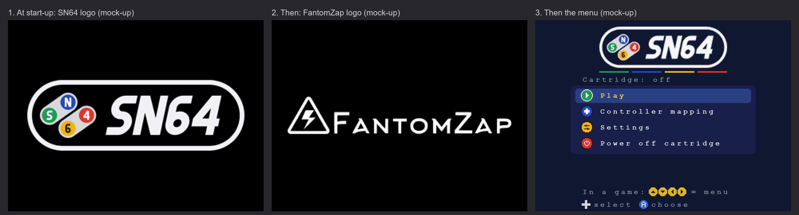
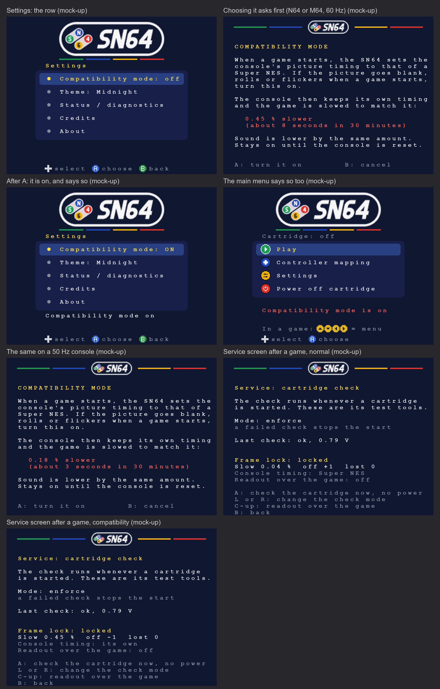
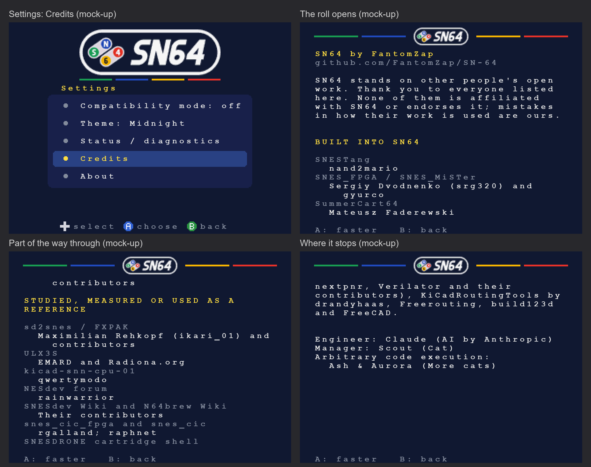
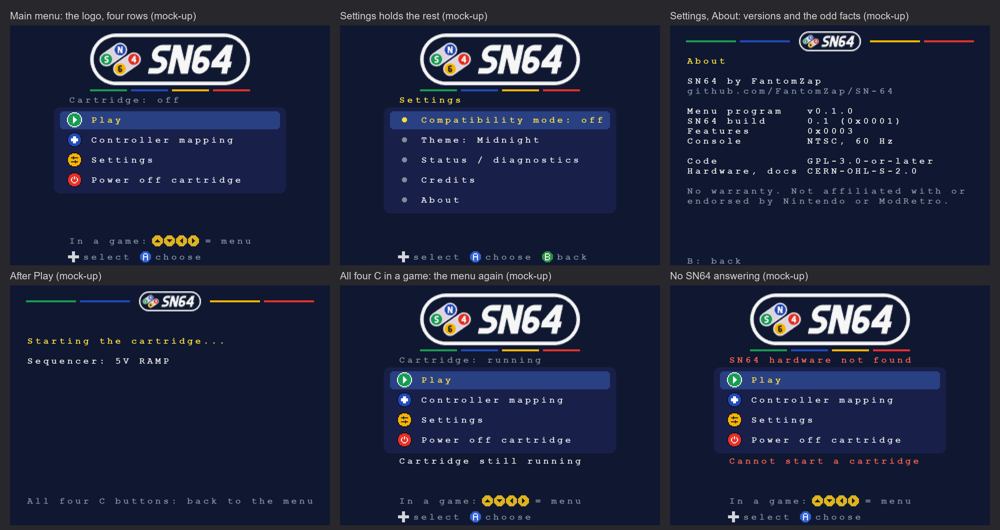
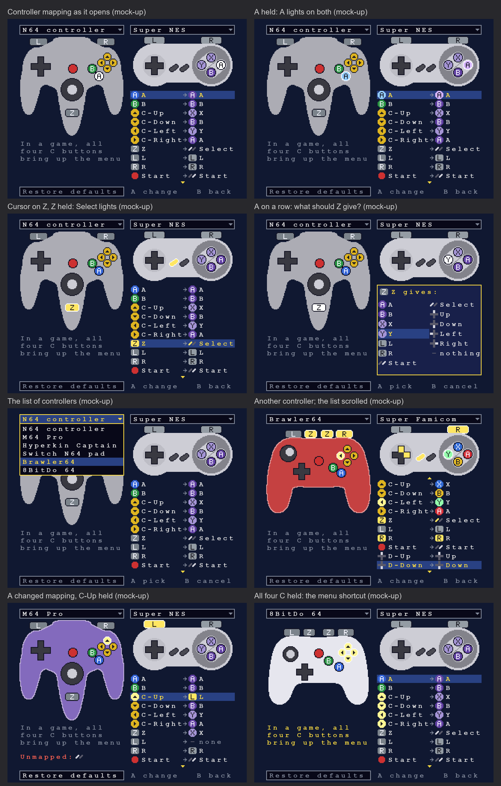
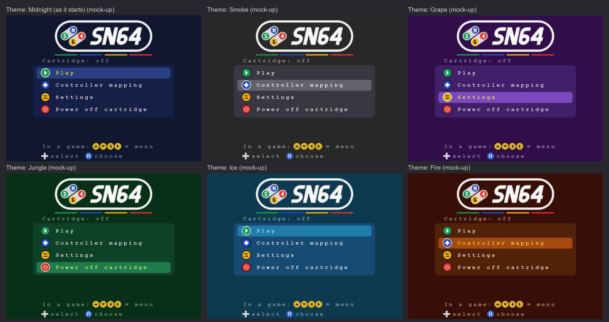
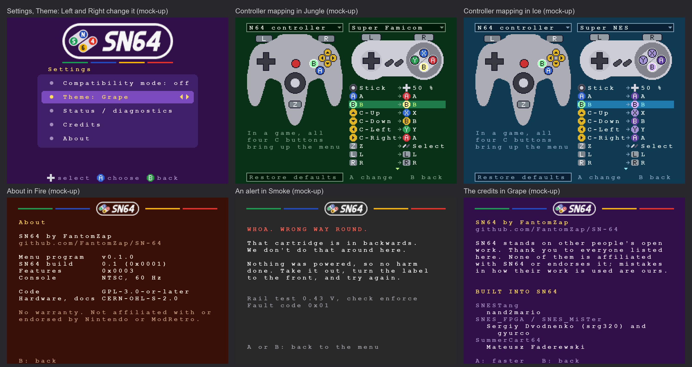

# N64 bootstrap ROM: implementation and evidence

Implemented 2026-09-29. This is the first version of the program the N64 or M64 runs from the SN64 cartridge. It is built with libdragon and passes a boot-checksum check, host unit tests and a co-simulation against the FPGA N64 endpoint. **It has not run on an N64, an M64 or an emulator.** The register contract is the [endpoint note](n64-endpoint-implementation.md). Relevant requirements are SN64-06-01, -06-02, -06-03, -09-02 and -08-13; none is accepted by this work.

## Plain-language summary

When the console powers on, it runs whatever program the cartridge holds. For SN64, that program is a small menu. It shows the adapter's version and power status, and offers four items: play, controller mapping, settings, and power off the cartridge (the menu as reworked on 2026-10-01, see the last section). Every frame it reads the N64 controllers, converts the buttons to SNES buttons, and hands them to the FPGA through the mailbox registers. A default mapping is built in: the D-pad and Start go straight across, Z becomes Select, and the face and C buttons form the SNES A/B/X/Y diamond. Nothing is written to the adapter unless it first answers with the SN64 signature, and the cartridge stays unpowered until the user chooses to start it.

## Files

| File | Role |
|---|---|
| [firmware/bootstrap/src/main.c](../../firmware/bootstrap/src/main.c) | Menu, 60 Hz controller/mailbox loop, screens |
| [firmware/bootstrap/src/sn64_mailbox.h](../../firmware/bootstrap/src/sn64_mailbox.h) | Register map, 32-bit pairing rule, provisional STATUS layout |
| [firmware/bootstrap/src/sn64_mapping.c](../../firmware/bootstrap/src/sn64_mapping.c) / `.h` | Default N64 to SNES table and mapping function; no libdragon dependency |
| [firmware/bootstrap/src/sn64_padview.c](../../firmware/bootstrap/src/sn64_padview.c) / `.h` | Controller pictures with buttons that light, and the single-button pictures; no libdragon dependency |
| [firmware/bootstrap/src/sn64_mapscreen.c](../../firmware/bootstrap/src/sn64_mapscreen.c) / `.h` | The controller mapping screen: cursor, lists, choices, drawing; no libdragon dependency |
| [firmware/bootstrap/Makefile](../../firmware/bootstrap/Makefile), `rom.mk` | Build, check, convert, test, fault-injection targets |
| [firmware/bootstrap/tools/setup_libdragon.sh](../../firmware/bootstrap/tools/setup_libdragon.sh) | Pinned toolchain install with SHA-256 check |
| [firmware/bootstrap/tools/n64_cic_check.py](../../firmware/bootstrap/tools/n64_cic_check.py) | CIC-6102 boot check (IPL2 hash of the IPL3 block) |
| [firmware/bootstrap/tools/z64_to_rom_words.py](../../firmware/bootstrap/tools/z64_to_rom_words.py) | `.z64` to ROM-window word image, with a hard size check |
| [firmware/bootstrap/tools/test_rom_tools.py](../../firmware/bootstrap/tools/test_rom_tools.py) | Self-checking tool test with `--inject-fault` |
| [firmware/bootstrap/tests/test_mapping.c](../../firmware/bootstrap/tests/test_mapping.c) | Host mapping test; `-DSN64_FAULT_SWAP_AB` injects a wrong table |
| [firmware/bootstrap/tests/test_padview.c](../../firmware/bootstrap/tests/test_padview.c), [test_mapscreen.c](../../firmware/bootstrap/tests/test_mapscreen.c) | Host tests of the controller pictures and of the mapping screen; each has a fault build |
| [firmware/bootstrap/tests/tb_bootstrap_rom_window.sv](../../firmware/bootstrap/tests/tb_bootstrap_rom_window.sv) | Verilator bench: converted image into `sn64_n64_endpoint`, PI read-back, per-frame mailbox traffic; `+corrupt_load` injects a fault |
| [firmware/bootstrap/tools/run_rom_window_sim.ps1](../../firmware/bootstrap/tools/run_rom_window_sim.ps1) | Builds and runs that bench plus its negative run |

## What is reused

| Source | Version | License | Use |
|---|---|---|---|
| libdragon | trunk `e356bf3f56f7afbf7e5246329562f145965cfdfc` (2026-09-15) | Unlicense | Linked into the ROM. Its IPL3 (`tools/ipl3.h`, the production build) is signed for CIC-6102 (libdragon `boot/README.md`), so no header CRC is needed. Its `n64tool`, `n64sym` and `n64elfcompress` build the image. |
| libdragon toolchain | `gcc-toolchain-mips64-win64.zip`, release `toolchain-continuous-prerelease`, asset of 2026-09-15, GCC 16.2.0 | GPL (GCC/binutils); tools only | `mips64-elf-*` and `make.exe` |
| ares | `mia/medium/nintendo-64.cpp` at `433d07fbdb90b02e6a0947b9de0fe5670378c375` | ISC | `ipl2checksum` ported to Python in `n64_cic_check.py`; the ISC notice is kept in the file |
| SN64 `tb_n64_endpoint.sv` | this repo | GPL-3.0-or-later | PI host-model tasks copied into the integration bench |

Toolchain SHA-256: `bd201c35afee4aceb9d2a80c6dc9d25eb2a4d426b1b26ef38e33881641b4d1d0`, matching the digest GitHub publishes for the asset. Install locations:

- toolchain: `%USERPROFILE%\.codex\tools\libdragon-gcc-toolchain-20260915\n64inst` (this is `N64_INST`)
- libdragon source: `...\libdragon-trunk-e356bf3`

Everything runs from Git Bash and w64devkit 2.10.0 with no admin rights, Docker, WSL or MSYS2. libdragon's tools Makefile asks `pacman` for an MSYS2 date; the setup script passes `MSYS2_AGE=20260101`, which turns on libdragon's own `strndup` fallback. The libdragon build shows only upstream deprecation warnings. No code was vendored into `fpga/vendor/`.

## Mailbox use

The CPU makes only 32-bit PI accesses; libdragon's `io_write` waits for the PI to go idle before each one. The PI splits each 32-bit access into two 16-bit bus cycles, upper half first. Each frame the bootstrap therefore does the following:

1. Reads `{MAGIC,VERSION}` at `0x00`. If MAGIC is not `0x534E`, it stops there and never writes.
2. Reads `{STATUS,SEQ}` at `0x04` and reads back `{JOY1,JOY2}` and `{STICK,CONTROL}`.
3. Writes `{JOY1,JOY2}` to `0x10`, `{JOY1_STICK,CONTROL}` to `0x14`, then `0x0001_0000` to `0x18`. That last write is COMMIT at `0x18`; the RTL ignores the `0x1A` half, so SEQ goes up exactly once per frame.

After every boot the bootstrap writes `CONTROL = 0` before anything else, in line with the default-off rule. While the menu is on screen it sends a neutral pad. **Play** (called Start SNES cartridge until 2026-10-01) sets `run_request` and forwards both controllers. **All four C buttons together** return to the menu while the cartridge keeps running (until 2026-10-01: Z+L+R held for 60 frames). **Power off cartridge** clears `run_request`. Play is refused while STATUS shows a latched fault.

**STATUS layout is provisional.** The RTL passes `status_flags` through with no defined layout. `sn64_mailbox.h` proposes one, taken from the `sn64_power_sequencer` ports:

| Bit | Meaning |
|---|---|
| 0 | configured |
| 1 | host/FPGA rails ok |
| 2 | cart 5 V ok |
| 3 | interface rail ok |
| 4 | bus_permit |
| 5 | fault_latched |
| 6 | run_request seen |
| 7 | PAL |
| 11:8 | sequencer `state` |
| 15:12 | reserved |

The top level still has to wire it.

## Default mapping

**The table below is the first proposal (2026-09-29) and no longer what the program does.** The owner set the defaults on 2026-10-01: every button to the Super NES button of the same name and Z to Select. The table in force is in the last section, "Menu rework and the controller mapping screen".

The SNES image uses the shift order: bit 0 = B, then Y, Select, Start, Up, Down, Left, Right, A, X, L, R. **1 = pressed.** Bits 15:12 are 0.

| N64 | SNES | Basis |
|---|---|---|
| D-pad | D-pad | spec |
| Start | Start | spec |
| Z | Select | spec |
| A | B | proposed: primary thumb button to SNES primary (bottom) |
| B | Y | proposed: secondary thumb button to SNES left ("run") |
| C-Up / C-Right / C-Down / C-Left | X / A / B / Y | proposed: C diamond laid out like the SNES diamond |
| L / R | L / R | proposed |
| Analog stick beyond ±40 | D-pad | proposed; roughly half of a typical ±80 stick range |

Opposing directions (Up+Down, Left+Right) cancel, because a real SNES D-pad cannot produce them. The raw stick is still written to JOY1_STICK for the deferred virtual mouse.

## Verification

All results below were run on 2026-09-29 with the toolchain above.

- **Build.** `make` produces `build/n64-bootstrap/sn64_bootstrap.z64`, **114,688 bytes** (aPLib, `N64_ROM_ELFCOMPRESS=2`). The build uses libdragon's `-Werror` flags and gives no warnings. ELF: 115,256 text, 23,388 data, 3,036 bss. SHA-256 of this build: `a00cabcb80a30d368eae80f5d2dba546b70be8eaf612c56b8f91610f8923904b`. Reproducibility across machines has not been checked.
- **CIC-6102 boot check.** `make check` reports `IPL2 checksum (seed 0x3F) = 0xA536C0F1D859, CIC-6102 expects 0xA536C0F1D859` and `OK: ... is bootable with CIC-6102`. The port and libdragon's signing are independent sources, and they agree.
- **Word image.** `make words` reports `OK: 114688 bytes -> 57344 words in a 65536-word window (ROM_ADDR_BITS=16, minimum 16)`.
- **Mapping.** `make test`: `PASS: mapping table, 27 checks`.
- **Tools.** `PASS: ROM tools, 17 checks`. The checks are:
  - the built ROM passes;
  - a flipped bit at IPL3 `0x800`, a flipped bit at `0xFFC`, a `.v64` header and an all-zero IPL3 all fail;
  - the word image round-trips all 114,688 bytes, and word 0/1 = `0x8037 0x1240`;
  - the image is rejected for `ROM_ADDR_BITS` 12 and 15;
  - the CLIs return exit codes 0 and 1.
- **Negative runs.** Each of these must fail, and `make test-negative` passes only if all do (`NEGATIVE: all fault-injected runs failed as required`):
  - `-DSN64_FAULT_SWAP_AB` fails 3 of 27 checks;
  - `--inject-fault size-guard` fails 2 of 17 (`image rejected for ROM_ADDR_BITS=12: accepted`);
  - `--inject-fault checksum` fails 3 of 17 (a header-only checker lets corrupted IPL3 through).
- **Bug found in the test itself.** On an early rerun, a stale `words.mem` from the previous run made the check "converter writes nothing when it rejects" fail. The test now deletes the file first. Two back-to-back reruns then passed.
- **Co-simulation with the FPGA endpoint.** `run_rom_window_sim.ps1` (Verilator, `sn64_n64_endpoint` with `ROM_ADDR_BITS=16`) reports `PASS: bootstrap image (65536 words, last non-zero word 55547) loaded via rom_we, 76 words read back over PI, mailbox frame traffic (32-bit pairs, COMMIT once per frame, run/power-down) correct (68015 clocks)`. It reads back the header, both ends of IPL3, the start of the program and the last program word, then replays three bootstrap frames and checks JOY1/JOY2, the stick, run_request and SEQ = 1, 2, 3. With `+corrupt_load` it fails with `FAIL ROM word 32 (byte 0x40): read 3045 expected 3044`. The bench uses the endpoint's AD output enable, not bus values, for its ownership checks.

Limits:

- The CIC check covers only IPL3 (`0x40`–`0xFFF`), which is all the console checks for a libdragon ROM. Corrupting a byte after IPL3 is not detected; the test records this on purpose. Use the SHA-256 in the manifest for image integrity.
- The co-simulation replays the bootstrap's bus traffic by hand. It does not execute the MIPS code.
- No emulator run and no hardware run have been done. Controller behaviour, video output, frame pacing, and whether the IPL3 and the whole program boot on both consoles are all untested.

## Resource finding: the ROM window does not fit the current plan

| Compression | ROM size | ROM_ADDR_BITS needed | DP16KD |
|---|---|---|---|
| libdragon default LZ4 (level 1) | 147,456 bytes | 17 | 128 |
| aPLib or Shrinkler (levels 2 and 3; both measured) | 114,688 bytes | 16 | 64 (1K×16 each) |

The endpoint's current default of 12 bits (8 KiB, 4 DP16KD) holds only the header and IPL3. The ECP5-85F has 208 EBR, and the console plus bridge already uses 139. A 64-block ROM would leave about 5. This is arithmetic, not a synthesis run. Of the 114,688 bytes, 39,007 are uncompressed backtrace symbols (`.sym`), which libdragon's `n64.mk` always appends. The compressed ELF is 64,664 bytes.

Options, not yet decided:

1. Drop `.sym` with a custom `.z64` rule and trim libdragon modules.
2. Serve the window from the configuration SPI flash or a small PSRAM. The libdragon IPL3 reads the ROM only while booting, so latency matters much less than for a game.
3. Keep BRAM and accept the EBR cost.

2026-09-29: the menu shows the region and its source (main screen) and the ROM-header probe result (status screen) from REGION_INFO/REGION_SOURCE; the status-screen rows no longer overlap. Rebuilt: 114,688 bytes, SHA-256 `64d2b2a334117546a0610f3bdcafecb0809441a011f79f9d5dae5f49a72904b5`, CIC-6102 OK, co-simulation PASS.

## Still open

1. **Run it:** first in an emulator (ares, optional), then on an original N64 and on an M64 with the endpoint and CIC on real hardware. Measure boot time and PI timing.
2. **ROM storage decision** (above), and set `ROM_ADDR_BITS` in the top level to match. The endpoint default is still 12.
3. **STATUS wiring:** adopt or replace the provisional layout in the top level and record it in the endpoint note.
4. **Fault clear:** the power sequencer has a `fault_clear` input but no mailbox bit reaches it. A proposed `CONTROL` bit 1 (pulse) would need an RTL change, and then a menu item.
5. **Configurable mapping (SN64-06-03):** runtime editing is built (2026-10-01, the mapping screen in the last section). **Persistence is still missing:** there is no save storage yet, so the mapping is the default again after every power-up.
6. **Telemetry (SN64-08-13):** voltage/current/temperature registers do not exist in the mailbox yet.
7. **SNES serializer:** `joy1_buttons` to `JOY1_DI`/`JOY2_DI` is not in the RTL. It must follow the polarity above (1 = pressed in the image).
8. **Controller-2 menu input** and GameCube-style pads on the M64 are untested. libdragon reports them through the same `joypad` API.
9. **Sound loop (found 2026-10-01 by reading the code, not by ear).** `game_audio()` filled libdragon's 1,280-sample buffers from a ring that holds 1,024, padding the rest with silence, so the sound would have buzzed. **Reworked the same day**, see "Frame lock, compatibility mode and the sound path" below. Not heard on a console yet.
10. **Frame pacing.** The display loop followed the Super NES's 60.10 Hz while the console's video ran at its own rate, so a picture was dropped every few seconds. **Reworked the same day**, same section. Not seen on a console yet.

## Console video path (2026-09-29): the game on the console's own screen

When a cartridge runs, the boot program no longer draws a status page: it switches the display to 256 × 240 (16-bit), sets PI domain-2 timing to LAT 0x40 / PWD 5 / PGS 7 / RLS 1 for the frame window at `0x0800_0000`, and every frame copies the SNES picture in four 56-line DMAs, each only after `FRAME_STATUS.lines_done` says those lines are finished (or the SNES has moved on to the next frame), so a line is never read while it is being written. The 224 lines sit centred in the 240-line screen; the borders are cleared once per buffer. Audio: `audio_init(32000, 4)`; each frame the new samples since the last read pointer are fetched from the ring at `0x0801_E000` (wrapping at 1024 pairs) into the N64's audio buffers, padded with silence if the ring is empty. The menu hotkey (Z+L+R for 1 s) switches back to the 320 × 240 menu. Rebuilt: 131,072 bytes, exactly the 128 KiB window at `ROM_ADDR_BITS = 16`; the board top now uses a 256 KiB flash window (`ROM_ADDR_BITS = 17`) for headroom. SHA-256 `92868c03f98ba7b5e5e8173d7d09b4a97128712b45c68f22e18346a7c100c36e`, CIC-6102 OK. **Not run on a console; the VI 256-wide framebuffer scaling and the PI domain-2 timing on real hardware are the first things to check on a prototype.**

## Cartridge check in the menu (2026-10-01)

For the owner's idea of catching a cartridge that is in back to front ([reversed-cartridge-detection.md](reversed-cartridge-detection.md)). The check itself is in the FPGA; the menu chooses its mode, shows its result, and says so on the screen.

- No item on the main menu (owner, later the same day: "the 2 check things should be hiden and just be there and work upon clicking the start game option"). "Start SNES cartridge" (the row called Play since the menu rework) asks for the check in enforce mode (`SN64_CHECK_MODE_DEFAULT`); a cartridge that fails is not powered.
- The test tools are on a service screen the main menu does not show: Status / diagnostics, then Z (under Settings since the menu rework). A runs the check alone and shows the result; L or R steps the mode through enforce, report only and off until the console is reset. While the mode is not enforce the main menu says so in red.
- The mode travels in `CONTROL` bits 5:4 with every frame's write. The result comes back in `CART_CHECK`, read with `FAULT` as the 32-bit pair at `0x08`.
- New alert screen. A latched fault or a finished check ends the request and shows the reason; the fault word is copied first, because dropping the request clears the latch. The reversed-cartridge text is "WHOA. WRONG WAY ROUND. / That cartridge is in backwards. / We don't do that around here. / Nothing was powered, so no harm done. Take it out, turn the label to the front, and try again." A rail that does not rise at all is reported as a short. In report-only mode a failed check followed by a power fault says that the check had warned.
- The game display is entered only once the sequencer reports RUNNING with the SNES clock on. Until then a text screen shows "Checking the cartridge..." or "Starting the cartridge...". Before this change a start that ended in a power fault left the program waiting in the frame copy for lines that never came.
- The decision which screen a result gives is in `src/sn64_cartcheck.c`, pure C. Host test `tests/test_cartcheck.c` (in `make test`): 74 checks, including that every screen line fits 38 columns. `make test-negative` builds it with a wrong short/backwards level and requires it to fail.

Rebuilt: 131,072 bytes (unchanged size), CIC-6102 check OK, word image fits `ROM_ADDR_BITS = 16`. Not run on a console or an emulator, like the rest of the menu.

## Splash screens at start-up (2026-10-01)

Owner: "do sn64 logo splash followed by fantomzap logo splash", on the N64 and the M64 alike (it is one ROM). When the console starts, the program shows the SN64 logo, then the owner's FantomZap logo, then the menu. Each logo fades in over 20 frames, holds for 80 and fades out over 20: 2.0 s at 60 Hz, 2.4 s at 50 Hz. A, B or Start skips straight to the menu. The cartridge request is cleared before the first splash, as before.

The picture is drawn by `tools/mock_screens.py` from the pixels the ROM holds, not captured from a console.

- Pictures: `tools/make_splash.py` draws both logos from their files in `assets/logo/` at screen size, puts them on black and reduces them to a palette: the SN64 logo 272 x 89 in 64 colours, the FantomZap logo 280 x 47 in 16 greys. The result is `src/sn64_splash_data.c` (generated; `make splash` rebuilds it). A first try with median-cut colour reduction merged the blue and the green button; maximum-coverage reduction keeps them (worst error 19 of 255 in any channel).
- Drawing: `src/sn64_splash.c`, pure C. It fills the frame black and draws the picture in the centre through a palette scaled to the brightness of the frame.
- Host test `tests/test_splash.c` (in `make test`): 35 checks on the fade, the centring, the clipping, brightness and the picture data. `make test-negative` builds it with the picture shifted 8 pixels and requires it to fail.
- ROM: 131,072 bytes as before, SHA-256 `2d3a8feab927c465a7ef447479a81e3da6cee084b980a5e85ce5f0d040395140` (with the service screen that was added afterwards). The two pictures and their code took 6.6 KB of the compressed program; 5,514 bytes are left in the 128 KiB window that `ROM_ADDR_BITS = 16` gives. The v2 board uses 17 (256 KiB).

Not run on a console or an emulator, like the rest of the menu. The FantomZap name and logo are the owner's and are not under the open licences (see `NOTICE`).

## Menu ideas (2026-10-01)

The owner asked what features and options the menu should get and said the menu system could be repackaged. The list of candidates, with what each would take, is in [menu-ideas.md](menu-ideas.md). Nothing in it is decided or built.

## Frame lock, compatibility mode and the sound path (2026-10-01)

Owner: keep the console's own picture rate in the menu and switch only when a game starts; and a compatibility mode in the menu, turned on through a confirmation screen that states how much slower the game then runs, in case an M64 does not take the changed timing. The design and all the numbers are in [frame-lock.md](frame-lock.md). What changed in the program:

- **Game loop.** Paced by the console's vertical interrupt. Each picture: frame lock, sound, first quarter of the picture, controllers, the other three quarters. The controllers are read after the first quarter, so the Super NES sees them at the end of the same picture and not a picture later. A fetch that sees no progress for 40 ms gives up, so a stopped game clock no longer hangs the program.
- **Frame lock** (`src/sn64_framelock.c`, pure C). Normal mode writes the Super NES's picture shape to the console's three timing registers when the game display starts (262 lines of 3093 video clocks on a 60 Hz console) and libdragon's values come back when it ends. In both modes a control loop reads `FRAME_PHASE` once a picture and steers `PACE` so the game stays a fixed distance ahead of the console's picture swap.
- **Compatibility mode.** A fifth row on the main menu (a row under Settings since the menu rework). Choosing it shows the confirmation (0.45 % slower on a 60 Hz console, 0.18 % on a 50 Hz one); A turns it on; choosing it again turns it off. It is off after every start-up: the menu has nowhere to keep settings. While it is on the main menu says so in red.
- **Sound** (`src/sn64_resample.c`, `src/sn64_audioout.c`, pure C). libdragon's audio queue is no longer used. The program sets the console's sound divider itself, fits the game's samples with a four-point cubic resampler, and hands the console one block per picture.
- **Service screen** (Settings, Status / diagnostics, then Z): the lock's state, the slowdown in force, the position error and the pictures lost; C-up switches on a one-line readout above the game picture.
- **Mailbox:** `FEATURES` at 0x0C, the pair `{FRAME_PHASE, PACE}` at 0x24. An FPGA build without them reads 0 and the program runs free, as before but with the new sound path.

Evidence, all on the PC:

- `make test`: `test_framelock` 120 checks, `test_resample` 34, `test_audioout` 36, beside the earlier ones (mapping 27, cartridge check 74, splash 35, ROM tools 17).
- `make test-negative`: a control loop that pushes the wrong way, a resampler that loses its carry and a sound queue that loses the pairs it holds back are each rejected, with the earlier five.
- ROM: **147,456 bytes**, SHA-256 `d85ec509b9a4e3b587e919326b1b9debbd3bd46379703439c6c89b8a8e2936c9`, CIC-6102 check OK. It no longer fits the 128 KiB window (357 bytes over), so `ROM_ADDR_BITS` is **17** in the Makefile, the co-simulation and its script, as on the v2 board (256 KiB window, 130 KB free).
- Co-simulation with the FPGA endpoint at `ROM_ADDR_BITS = 17`: the image reads back, and the lock's traffic (`FEATURES`, the `FRAME_PHASE`/`PACE` pair read and written) arrives as written; the corrupted-load run fails as required.

**Not run on a console or an emulator.** The first things to look at on hardware are in the table at the end of [frame-lock.md](frame-lock.md).

## Credits roll (2026-10-01)

Owner: a credits section that names everyone the repository credits, then Claude, then his cats at the very end, without his own name: "Manager: Scout (Cat)" and "Arbitrary code execution: Ash & Aurora (More cats)". The last line is a record of how this session went: three messages of nothing but plus signs arrived while the frame lock was being built, sent from the number pad by the cats.

- **One source.** The roll is [CREDITS.md](../../CREDITS.md) put on the screen. `tools/make_credits.py` reads its tables in order (project, then who made it), the tools paragraph, and its last section, "The SN64 crew", and writes `src/sn64_credits_data.c` (`make credits`). The opening lines are the credit line "SN64 by FantomZap" and the source location from `NOTICE`, which the licence terms ask every notice shown by the program to keep. A row added to CREDITS.md appears in the roll; `make test` fails if the roll was not regenerated.
- **The owner's name is not in it.** The credit line carries his handle, as it does everywhere else in the project.
- **Sixth row of the main menu, "Credits"** (a row under Settings since the menu rework). The text rises half a pixel a picture (about 30 seconds for the 77 lines at 60 Hz); holding A makes it eight times as quick; B or Start goes back. It stops with the crew in the middle of the screen.
- **36 columns, not the menu's 38**, so nobody's name stands at the very edge of the screen, where a television may cut it off. Titles in the highlight colour, project names dim, people white.
- **Drawing.** `src/sn64_credits.c` (pure C) says which lines are on screen at a scroll position. Only lines that lie wholly inside the window are drawn: libdragon's text drawing does not clip.
- Host test `tests/test_credits.c` (in `make test`): 25 checks on the text (fits, plain 7-bit, opens with the credit line, closes with the crew in the owner's words, everyone named in CREDITS.md present) and on the geometry at every scroll position. `make test-negative` builds it with a line allowed to hang out of the window and requires it to fail.

Main menu layout with six rows: the message moved one row down (row 13), the two warnings to rows 15 and 16.

ROM: 147,456 bytes, SHA-256 `0b0f9f14a336bf9d24659761761e26e4349481ccaa4ae9158c68f13ddbd64d49`, CIC-6102 check OK; 133,234 bytes used, 128,910 free in the v2 board's 256 KiB window. Host tests 368 checks in eight sets, nine fault builds rejected; co-simulation with the endpoint passes. Not run on a console or an emulator.

## Menu rework and the controller mapping screen (2026-10-01)

Owner: "the main menu should be play, controller mapping, settings and power off cartridge", with the rest in a Settings sub-menu. For the mapping: "an n64 controller and a snes controller side by side with light up buttons corresponding to button presses", "a dropdown list of controllers for m64 input sake and another dropdown for snes compatible controllers", "each should have their buttons light up and also images of their singular buttons in the mapping part". Defaults: "the normal buttons should be mapped to their counterpart on the snes controller and the z button to the select button". "To bring up the sn64 menu they press all 4 c buttons together." And: "no actual nintendo logos on anything".

The picture shows the menus as they look since the rework described under "The menu's look" below.

### The menus

- **Main menu, four rows:** Play, Controller mapping, Settings, Power off cartridge. One line above them says whether the cartridge is off, starting or running. Play starts the cartridge, or goes back to a cartridge that is still running.
- **Settings:** Compatibility mode (with its confirmation screen, as before), Theme, Status / diagnostics (the service screen is behind Z there, as before), Credits, About. B goes back one level everywhere. Theme and About came later the same day, see "The menu's look" below.
- **Notes and refusals.** The line under the rows is in the text colour for a plain note ("Cartridge is off") and in the warning colour for a refusal ("Power fault: not starting"). The two standing warnings (cartridge check relaxed, compatibility mode on) show under the main menu's rows; Settings shows the first and says the second in its first row.
- **The technical lines** that stood on the main menu (STATUS word, sequence count, region) are on the Status screen, where they already were.

### The shortcut: all four C buttons

While a cartridge runs, all four C buttons of controller 1 pressed together bring the menu back. The cartridge keeps running and Play returns to it. This replaces Z+L+R held for a second.

- The four have to be seen together on 6 pictures in a row, a tenth of a second (`MENU_CHORD_FRAMES`). That is an addition of mine, so that a controller being plugged in or one bad read does not open the menu. The figure is an assumption until it is tried by hand.
- While all four are down the game is given none of them (`sn64_map_strip_menu_chord`). Up to that moment the buttons already down are passed on as usual: holding them back would delay every C press in every game.
- Controller 2 cannot open the menu, and its four C buttons are ordinary buttons.
- The main menu, the screen shown while a cartridge starts and the mapping screen each say what the shortcut is.

### Default mapping in force

| N64 | Super NES | Basis |
|---|---|---|
| A, B, L, R, Start, D-pad | the button of the same name | owner |
| Z | Select | owner |
| C-Up, C-Left, C-Down, C-Right | X, Y, B, A | my choice: X and Y have no namesake on an N64 controller, and the C diamond sits like the Super NES diamond |
| Stick past 50 % of its travel | D-pad, in eight directions | a setting since later that day, see "The stick" |

Opposite directions still cancel. One table serves both controllers.

### The mapping screen

The screen was reworked the same day, after the owner had seen the first version: "can you please just make the graphics closer to the right shapes", "the controllers I mean", and "the button list below can be scrollable too if it helps fit things". What follows is the reworked screen.

- **Two pictures side by side, in the controllers' real shapes.** Left: the controller in the player's hands, as large as its half of the screen allows. Right: the controller the game sees. A list box over each names it.
- **What is held lights on the left; what the game is given lights on the right.** Pressing Z lights Z on the left and Select on the right, and after a change the new button lights instead. The stick's cap moves with the stick and lights when the stick presses the D-pad (see "The stick" below).
- **The right side shows what the game gets.** Up and Down together light nothing on the right. Nor do the four C buttons while they make the menu shortcut.
- **The two lists.** Left, for the M64's sake, the controllers ModRetro lists as working with it: N64 controller, M64 Pro, Hyperkin Captain, Switch N64 pad, Brawler64, 8BitDo 64. Right: Super NES (purple and lavender buttons) and Super Famicom (four colours, which is also the Super NES of the PAL countries). On a PAL console the right list starts on the four-colour one.
- **The lists change the picture and nothing else.** Every controller in the left list reports the same 14 buttons and the stick to the console, and both in the right list have the same 12 buttons.
- **The mapping list** stands under the Super NES controller, which is a flat one and leaves the room. One column of 15 rows: the stick first, then the 14 buttons. A button's row: a small picture of the single button, its name, an arrow, a small picture of the Super NES button it gives, and that button's name. The small pictures light too. Ten rows are on the screen and the list scrolls with the cursor; a small mark above or below it says that there are more rows that way.
- **Changing a row.** A on a row opens its 13 choices (the 12 Super NES buttons and "nothing"), each with its small picture, in two columns in the place of the list, so both controllers stay in view. The choice under the cursor is marked on the right-hand controller. A takes it, B gives it up.
- **Under the player's controller:** three lines that say how the menu is reached from a game; they light up while all four C buttons are held. Below them one line of notes.
- **Buttons no row gives any more are shown** on that line in red, "Unmapped:" and their small pictures (their number if there are more than five), so a change that leaves Start out of reach is seen before a game is started.
- **Restore defaults** is a field at the bottom left.
- **Moving.** Up and Down go through the two lists, the 15 rows and the reset field, and round again; Left and Right change between the two lists.
- **Only the D-pad, A and B do anything here,** so every other button and the stick can be tried freely. B leaves when it is let go, so it can be seen to light first.
- **The row under the cursor is marked** in both pictures: its button blinks white. On the stick's row that is the stick and the whole D-pad.

### The stick

Owner: "we ought to create an input method option for the joystick. I was thinking beyond a certain percent pushed in a direction it can press a directional button? Perhaps if pressed diagonally beyond that threshold it can press the appropriate 2 directions at once?"

The stick already pressed the D-pad, but at a fixed half of its travel and with each axis judged on its own. It is now a setting, the first row of the mapping list: "Stick", an arrow, the D-pad, and a percentage.

- **One list of choices:** the D-pad from 20, 30, 40, 50, 60, 70 or 80 % of the stick's travel, or nothing. It starts at 50 %. "Nothing" is for a stick that drifts or a thumb that rests on it.
- **How far is measured from the middle, the same in every direction.** Before, each axis was compared with the threshold by itself. A push towards a corner then needed 41 % more travel than a push along an axis, and a diagonal push of 60 % of the travel pressed nothing at all while the same push straight to the right pressed Right.
- **Eight directions.** Past the set distance, the direction the stick points in decides: within 22.5 degrees of an axis it presses that one direction, between them it presses two at once. That makes eight equal slices of 45 degrees, one round each of the eight notches of the controller's gate.
- **With the D-pad.** Stick and D-pad are added together and opposite directions cancel, as before: Up on the D-pad and the stick pulled down give neither.
- **What the screen shows.** The stick's cap lights while the stick presses something; the arms it presses light on the Super NES controller and in the row's small picture. With the cursor on the row, a line under the controller reads "Stick now: 63 %": how far the stick is pushed at this moment, so a player can see what their own stick reaches before choosing.
- **A choice can be tried before it is taken.** While the choices are open, the pictures already behave as if the one under the cursor were set. The same now holds for a button's choices.
- **A full throw is taken as 80** of the controller's own units. libdragon's `joypad.h` gives about 85 for an original controller in good condition and as little as 60 for a well-worn one, so a worn stick still reaches 75 %. The reading on the screen stops at 100 %.
- **Both controllers** use the setting, like the rest of the mapping. It is not kept when the console is switched off.
- **The mouse is still deferred.** The raw stick goes to `JOY1_STICK` as before, for the Super NES mouse of a later update. This row is where that choice would be added.

| Setting | Units from the middle |
|---|---|
| 20 % | 16 |
| 30 % | 24 |
| 40 % | 32 |
| 50 %, to begin with | 40 |
| 60 % | 48 |
| 70 % | 56 |
| 80 % | 64 |

Not built: a little slack round the boundaries. A stick held exactly on the set distance, or exactly between two slices, can flicker between two answers. Whether that is ever felt has to be judged with a real stick; the usual converters do without it. Also not built: a four-directions-only choice, and measuring one's own stick's full throw instead of assuming 80.

### The right shapes

The first version drew every controller from discs and bars and got the shapes wrong: the N64 controller came out wide and squat with stubby handles. Now each picture follows a photograph of the controller lying flat.

| Picture | Size on the screen | Where the shape comes from |
|---|---|---|
| N64 controller | 138 x 132 | Measured on a photograph: outline and the place and size of every button. [Nintendo-64-Controller-Gray-Flat.jpg](https://commons.wikimedia.org/wiki/File:Nintendo-64-Controller-Gray-Flat.jpg), Evan-Amos, public domain |
| M64 Pro, Hyperkin Captain, Switch N64 pad | 138 x 132 | The same outline: the makers' pictures show the same three-handled shape. Another body colour each |
| Super NES and Super Famicom | 132 x 57 | Measured on a photograph: two round ends, a flat top, a shallow step along the bottom, the round hollow of the D-pad, the darker round with its two slanted pads. [SNES-Controller-Flat.jpg](https://commons.wikimedia.org/wiki/File:SNES-Controller-Flat.jpg), Evan-Amos, public domain |
| Brawler64 | 138 x 99 | Read by eye off Retro Fighters' product picture. Approximate |
| 8BitDo 64 | 134 x 92 | Read by eye off 8BitDo's product pictures, none of which is straight from the front. The least certain of the six |

- **How an outline is made.** `tools/make_padshapes.py` holds each outline as a few dozen points, as fractions of the controller's width and height. It lays a smooth closed curve through them, fills it, and writes one list of pixel runs per row to `src/sn64_padshape_data.c` (`make padshapes`). The picture code draws those runs and puts the buttons on them. `make test` fails if the file is not what the script writes now.
- **Only proportions were taken.** No photograph, logo or lettering is in the repository.
- **Where the pictures knowingly differ from the real things.** The shoulder buttons stand up above the top edge so that they can be seen and can light; on the controllers they are behind it. Z is shown on the middle handle of a three-handled controller; it is under it. The body colours only tell the entries apart.

### No logos

The pictures carry no maker's logo and no maker's lettering: the letters on the buttons are five-by-seven dot letters drawn for SN64, and the names in the two lists are plain text in the console font. `NOTICE` names the trademarks. A search of the repository on the same day found no Nintendo logo in it: the only logos are the SN64 one, which is original artwork, and the owner's FantomZap one.

### How it is built

| File | Role |
|---|---|
| `src/sn64_mapping.c` | the table, the defaults, the shortcut, the choices in the order the screen offers them, the buttons nothing gives |
| `tools/make_padshapes.py`, `src/sn64_padshape_data.c` | the outlines of the player's controllers: the points, and the pixel runs generated from them |
| `src/sn64_padview.c` | the controller pictures (outline, buttons at their places, what is lit), the single-button pictures and plain shapes, drawn into the 16-bit screen buffer |
| `src/sn64_mapscreen.c` | the screen: cursor, the list that scrolls, the two controller lists, the choices, restore, leaving, and where everything is drawn |
| `src/main.c` | the two menus, the shortcut, and the mapping screen's text in the console font |

The modules are pure C with no libdragon dependency, so the host tests run the code the ROM runs.

### Evidence, all on the PC

- `tests/test_mapping.c`: 69 checks (defaults, cancelling, the shortcut, changing the table, the choices, the buttons nothing gives; the stick: each percentage presses exactly from its distance, a full throw every 5 degrees round the circle gives the right one or two directions, nothing, the stick with the D-pad).
- `tests/test_padview.c`: 438 checks. The shapes: three handles side by side of which only the middle one reaches the bottom, a body about as tall as it is wide, two handles on the other two, a Super NES controller more than twice as wide as high with a flat top and a step along the bottom. For each of the six controllers and both colour sets: every button and the stick light their own place and no other pixel, no two share a pixel, the cursor's mark, nothing outside the picture's box. The single-button pictures are there, differ from one another and light. Pictures drawn across the edge of the screen are cut off there.
- `tests/test_mapscreen.c`: 127 checks. The cursor's path, the list scrolling and its marks, both controller lists, the choices for a button (every one can be reached), the choices for the stick, restore, leaving on B let go, the buttons that do nothing. On the drawn screen: each button and the stick light themselves, what they give and the two small pictures of their row, and nothing else changes; a choice under the cursor is in force for the pictures before it is taken; all text stays on the screen.
- `make test-negative`: a build in which A lights B's place, a build in which B takes a choice, and a build in which the stick is judged one axis at a time are each rejected. 12 fault builds in all.
- All host tests: 975 checks in ten sets.
- ROM: **163,840 bytes**, SHA-256 `f7959a0e52404afffa0c89de313ec7d4497881fb5ab78fee6dac2c4e4078bfbf`, CIC-6102 check OK; 150,073 bytes used, 112,071 free in the v2 board's 256 KiB window. The file is padded to the next 16 KiB, and the stick option took the used part past 147,456.
- Co-simulation with the FPGA endpoint passes with the new image; its first frame carries the new default (A and Start give 0x0108).
- The mock-ups above are made from the pixels and the text positions the code under test produced (`make test-mapscreen`, then `tools/mock_screens.py`). Only the font differs from the console's.

### Limits and what is assumed

- **Not run on a console or an emulator.** How the pictures look on a television, and whether this screen keeps 60 pictures a second, are not known. A count on the PC gives 44,000 to 81,000 pixels drawn a picture besides the text and the cleared screen. If that is too much for one picture, the lights follow the buttons one picture later and nothing else changes.
- **Nothing is kept when the console is switched off.** The mapping, the two lists and compatibility mode go back to their defaults. The SN64 has nowhere yet for the menu to store settings.
- **One mapping for both controllers,** and the pictures show controller 1.
- **The controller list is my reading** of ModRetro's list of compatible controllers. The Brawler64 and the 8BitDo 64 are both drawn with two Z triggers. Only the N64 and the Super NES controller were measured, and on photographs, not on the controllers themselves.
- **The tenth of a second for the shortcut, the C-diamond defaults, and the stick's 50 %, its steps of ten and its eight equal slices are my choices.** The stick has only met numbers: no real stick has been read.

Sources: [M64](https://modretro.com/products/m64), [M64 Pro Controller](https://modretro.com/products/m64-pro-controller) and [ModRetro x Hyperkin Captain+](https://modretro.com/products/hyperkin-captain-plus-wired-controller) product pages (the controller list, and the shape of those two controllers), [Hyperkin Captain](https://www.hyperkinstore.com/products/captain-premium-controller), [8BitDo 64 Controller](https://www.8bitdo.com/64-controller/), [8BitDo 64 review, Nintendo Life](https://www.nintendolife.com/reviews/8bitdo-64-controller-for-switch-1-and-2-a-worthy-alternative-to-nintendos-n64-pad), [Brawler64, Retro Fighters](https://retrofighters.com/our-collection/brawler64-nextgen-n64-controller-original-v2/), [Brawler64 review, Nintendo Life](https://www.nintendolife.com/news/2019/06/hardware_review_retro_fighters_brawler64_controller_-_a_crowdfunded_upgrade_to_your_battered_original), and the two photographs by Evan-Amos on Wikimedia Commons named in the table above. Read 2026-10-01.

## The menu's look: the logo as the title, themes, About (2026-10-01)

Owner: "the title name on the menu can just be the logo centered on the top. We need some stylization I think. Maybe make a few themes?" Then: "Move all the version stuff and odd info to an about section in settings too. Also left justify the menu but tabbed in a little", corrected at once to "not indented but just moved right a bit to look more centered".

Pictures of the menus themselves are at the head of the section before this one.

### What changed

- **The logo is the title.** The two lines of text that headed every screen ("SN64 bootstrap v0.1.0" and the SN64 build) are gone. The main menu and Settings carry the SN64 logo, 160 pixels wide, centred at the top, with a thin rule under it in the logo's four colours. Every text screen carries the logo small, 62 pixels wide and centred, with the rule running out to both sides of it.
- **The rows are one left-justified block on a panel that is centred on the screen.** That is how I read the owner's correction: the rows keep one left edge, and the block as a whole stands in the middle.
- **Each row of the main menu has a round mark** in one of the logo's four colours with a small sign: play, a D-pad, two sliders, a power sign. The mark of the row under the cursor has a white line round it, as a lit button of the controller pictures has. The row under the cursor also stands on a bar.
- **What the buttons do is shown with their small pictures** at the bottom, the same pictures the mapping screen uses. On the main menu the line over that shows the four C buttons that bring the menu up from a game.
- **About** is a new row under Settings. It holds what the header used to say, and the odd facts: the credit line and the source location, the version of the menu program, the SN64 build and its feature word, the kind of console, the two licences, and a line that there is no warranty and no affiliation with Nintendo or ModRetro. The Status screen keeps the diagnostic words.
- **Theme** is a new row under Settings. A goes to the next theme. With the cursor on the row, Left and Right go both ways, and two small arrows on the row say so. The whole menu changes at once.
- **One line over the rows.** On the main menu it says the cartridge's state in a word, or in the warning colour that no SN64 hardware was found. On Settings it is the menu's name.

| Where things stand, 320 x 240 screen | Columns or rows |
|---|---|
| Large logo | 160 x 52, columns 80 to 239, rows 8 to 59 |
| Its rule | rows 64 and 65, as wide as the logo |
| Small logo | 62 x 20, columns 129 to 190, rows 6 to 25 |
| Its rule | rows 15 and 16, columns 16 to 119 and 200 to 303 |
| First line of a text screen | row 32 |
| Panel behind the rows | columns 44 to 275 |
| Bar under the cursor | columns 50 to 269, 18 rows high |
| Rows' marks, and the lines over and under the rows | from column 58 |
| Rows' text | from column 80 |
| First row | row 86; a row every 20 |

### The themes

A theme is nine colours: the screen, a panel, the bar under the cursor, the inside of a box, three text colours (text, dim, highlight), the warning colour, and the ink of the logo's ring and letters.

| Theme | Screen | Bar under the cursor | Highlight |
|---|---|---|---|
| Midnight | dark navy | blue | yellow |
| Smoke | charcoal | grey | white |
| Grape | dark purple | violet | yellow |
| Jungle | dark green | green | lime |
| Ice | dark blue-green | light blue | pale cyan |
| Fire | dark red-brown | orange | yellow |

- **Midnight is the look the menu had before,** and the one it starts in.
- **All six are dark,** so the logo's light ring and letters and the controller pictures stand out on each. A light theme is not built: the mapping screen marks a lit button with a white ring, which would have to be rethought first.
- **The pictures keep their own colours.** The logo's four buttons, the controller pictures and the single-button pictures look the same in every theme. Only the logo's ring and letters take the theme's ink, and all six themes give the same light ink today.
- **Every screen follows the theme:** the two menus, the mapping screen, and the text screens.
- **The theme is not kept** when the console is switched off, like every other setting.

### How it is built

| File | Role |
|---|---|
| `src/sn64_theme.c` | the six themes |
| `tools/make_title.py`, `src/sn64_title_data.c` | the logo as the title, in two sizes: generated from the two logo files in `assets/logo/` (`make title`) |
| `src/sn64_menuview.c` | the title, the main menu and Settings drawn whole, and the text of About |
| `src/sn64_mapscreen.c` | takes its colours from the theme |
| `src/main.c` | the text screens write their lines under the small title in the theme's colours |

- **The logo has see-through edges and takes the theme's ink.** A splash picture is stored on its black background. The title cannot be, because the background changes with the theme. `make_title.py` draws the logo's version for dark backgrounds and its version for light ones, which differ only in the ring and the letters. A pixel where the two differ is ink and is drawn in the theme's colour; any other pixel keeps its own colour. Each pixel is one byte: three bits say how solid it is, five say which colour.
- **`make test` fails if the logo files changed** and the title was not made again: the generated file records the hashes of the two files it came from.
- **The main menu and Settings clear the screen themselves,** so the screen is not cleared twice a picture.

### Evidence, all on the PC

- `tests/test_menuview.c`: 87 checks.
  - Themes: text, dim text, the highlight and the warning colour can each be read on the screen, on a panel and on the bar; no two themes share a name or a background.
  - The logo: solid pixels take their colour, see-through pixels leave the screen alone, edge pixels lie between the two; another ink changes exactly the ink pixels; a logo drawn across the edge of the screen is cut off there.
  - The title: the logo stands centred at the top in both sizes, the rule has four equal parts in the logo's four colours in the logo's order, and nothing is drawn below.
  - The two menus: the rows share one left edge, the bar and the lit mark are on the row under the cursor and no other, moving the cursor changes those two rows and nothing else, notes and warnings stand under the rows in the right colours, every text stays on the screen.
  - About: its lines, with and without an SN64 answering, and that none is longer than the screen is wide.
- `tests/test_mapscreen.c`: 128 checks. The new one: in each of the other themes the screen has the same words in that theme's colours, on its background, with the pictures as they were.
- `tests/test_credits.c` now uses the window the roll has under the small title, rows 32 to 228.
- `make test-negative`: a build with the title's logo 6 pixels off centre is rejected. 13 fault builds in all.
- All host tests: 1,063 checks in eleven sets.
- ROM: **163,840 bytes**, SHA-256 `16bb2243d451e40200a3348d84d5d5975f10b1159fd01f2466d2b6d621d5b297`, CIC-6102 check OK; 157,046 bytes used, 105,098 free in the v2 board's 256 KiB window. The two title pictures and the new code took 6,973 bytes. The file is padded in steps of 16 KiB and 6,794 bytes are left before the next step.
- Co-simulation with the FPGA endpoint passes with the new image (last non-zero word 78,522); the corrupted-load run fails as required.
- The mock-ups are made from the pixels and the text positions the code under test produced (`make test-menuview` and `make test-mapscreen`, then `tools/mock_screens.py`). The main menu, Settings and the mapping screen are the code's whole. Of a text screen the background, the small title, the colours and, for About, the lines are the code's; the other text screens' lines are laid out by the tool as `src/main.c` lays them out. Only the font differs from the console's.

### Limits and what is assumed

- **Not run on a console or an emulator.** How the colours look on a television or on the M64's HDMI output is not known; a dark colour on the PC can come out darker or more saturated there.
- **Whether the menus keep 60 pictures a second is not measured.** A menu picture is the cleared screen, the logo (8,320 pixels, blended only at its edges) and the panel (about 20,000 pixels). If that is too much for one picture, the cursor follows the D-pad one picture later and nothing else changes.
- **The bottom line of the screens stands close to the lower edge** (the menus' at rows 228 to 235, the text screens' at rows 232 to 239), where a television with a picture tube may cut it. That was so before, and it has not been seen on one.
- **My choices, not the owner's:** the six themes, their names and colours, Midnight as the one to start in, the marks and their signs, the panel and the bar, the rule in four colours, and what About says. The names of five of the themes are colour names that N64 owners know from the console's see-through colours; they are plain words, and no logo or artwork is involved.
- **The console's own 8-pixel font is still used.** A real font in two sizes is still only an idea ([menu-ideas.md](menu-ideas.md)).
