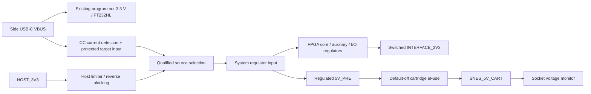

# Power and SNES cartridge protection architecture

Research/design candidate, 2026-09-29. No PCB, measured current budget or completed power circuit is claimed here. The same lower N64 connector serves original N64 and M64. The user proposed an M64 accessory-USB-to-SN64 short cable for supplemental power; that candidate is recorded below. FPGA power estimates and electrical qualification remain dependencies. The [power register](../../hardware/sn64/interfaces/power-budget.csv) deliberately leaves unknown loads blank; blank is **not zero**.

## Host power evidence

N64 contacts 9/17/34/42 are nominal 3.3 V; 13/38 are nominal 12 V. There is **no 5 V cartridge contact**. The pinned [SummerCart64 schematic](https://github.com/Polprzewodnikowy/SummerCart64/blob/a1e7996d2cbece686820a5c785029c68514f17b0/hw/pcb/sc64v2.kicad_sch) uses 3.3 V and leaves 12 V disconnected. This establishes reference topology, not an available-current allocation for SN64. No primary original-N64 cartridge-current guarantee was established; a console supply's total rating would not establish spare cartridge current.

The official [M64 mainboard schematic](https://cdn.shopify.com/s/files/1/0829/2034/1806/files/M64_MLB_SCH.pdf?v=1786637413), physical PDF page 28, identifies **U33 TPS2553DRVR, R191 = 41.2 kΩ, 500 mA Ilimit** on `V_3P3_CART`; the separate auxiliary branch is U32/R190. U33's output passes through R193, 10 mΩ. Enable/fault signals are MCU-controlled. Nominal 3.3 × 0.5 = **1.65 W** is a useful scale, not a guaranteed usable load budget: switch-limit tolerance, voltage drop, transients and host policy require margin and verification. Never set normal demand equal to the trip setting.

Physical page 29 generates `V_12P0_CART` with U25 **TLV61046A**, L5 = 10 µH and MCU-controlled enable. This is a small boost-converter path, not evidence for an unrestricted 12 V input. Its [internal switch-current limit](https://www.ti.com/lit/ds/symlink/tlv61046a.pdf) is not a 12 V output-current allowance. Leave HOST_12V unused until its enable policy and usable load are proven on both hosts. [Official source index](https://support.modretro.com/en_us/articles/m64-open-source-files-ByrpukdUGg).

### M64 accessory USB as supplemental power

A short **USB-C-to-USB-C cable from one M64 accessory port to SN64's side USB-C port** is a concrete candidate that could avoid an additional wall supply on M64. ModRetro describes two data-capable accessory ports for charging its controllers, separately from the console power input. It gives no accessory-current guarantee on that page. The supplied adapter's advertised up-to-30 W rating is for the entire console. [Official M64 product specifications](https://modretro.com/products/m64).

The downloaded official mainboard schematic is dated 2026-08-12, part number 100-0610; SHA-256 `c95b53ff5030ebc9c5b27614b6e18f98b34488e1a58d3e8d08203b326b3d04bb`. Physical pages 6 and 22 show the following; page 22 was also rendered and visually checked so the DNP markings were not lost in text extraction:

| Accessory connector | Source and CC path | Fitted current-advertisement strap |
|---|---|---|
| J3, Amphenol 10155435-00011LF USB-C | U24 TPS25821; `VBUS_CONN_2`, `CC1_2`, `CC2_2` | CHG pin 3 pulled down by R149 10 kΩ; R145 pull-up is DNP. |
| J2, same connector | U22 TPS25821; `VBUS_CONN_3`, `CC1_3`, `CC2_3` | CHG pin 3 pulled down by R144 10 kΩ; R78 pull-up is DNP. |

Both use `V_5P0_SYS`. Enables/faults go to the MCU; the GL850G hub carries data. The J1 power-input port is a different sink circuit. [Official schematic, pages 1, 6 and 22](https://cdn.shopify.com/s/files/1/0829/2034/1806/files/M64_MLB_SCH.pdf?v=1786637413).

**These fitted straps indicate standard USB current advertisement, not 1.5 A or 3 A.** TPS25821 CHG=0 advertises standard current; CHG=1 would advertise 1.5 A. Its overload limit is separately specified at 1.60/1.72/1.84 A minimum/typical/maximum under the datasheet conditions. This protection threshold does not grant a sink permission to draw that current. It is a Type-C source switch, not a higher-voltage PD supply. [TI TPS25821 Rev C, tables 3 and electrical characteristics](https://www.ti.com/lit/ds/symlink/tps25821.pdf).

Page 28 derives the shared 5 V rail from U31 TPS51385, which also supplies U29's 3.3 V conversion and other console branches. Its manufacturer 7 A converter rating is not spare accessory current. Page 1 annotates the console input contract as 9–12 V, 2.5 A operating/3 A maximum; this also is not an accessory allocation. No measured spare system-power budget or firmware enable policy has been established. [M64 schematic, pages 1 and 28](https://cdn.shopify.com/s/files/1/0829/2034/1806/files/M64_MLB_SCH.pdf?v=1786637413), [TI TPS51385](https://www.ti.com/product/TPS51385).

Candidate path: `one M64 accessory VBUS → short C-to-C cable → SN64 USB protection/current-policy circuit → source selection → FPGA regulators and regulated cartridge 5 V`. The lower cartridge interface remains the same on both consoles. Preserve reverse blocking and separate input accounting; do not connect two USB outputs together or assume a Y-cable doubles the budget.

Qualify this option with these exact checks:

1. Record the actual M64 hardware/firmware version and CC advertisement in both cable orientations. Until established otherwise, treat this hardware as the standard-current case. The FT232HL must enumerate and receive a valid configuration before using a USB 2.0 high-power allowance; 500 mA is conditional, and a blank EEPROM does not establish it. Confirm M64 actually configures this device rather than merely applying VBUS.
2. Measure startup, configured gameplay, reset, suspend, M64 power-off and detach behavior. Confirm the accessory port enables early enough for cartridge boot; otherwise avoid a boot dependency in which the console waits for SN64 while SN64 waits for USB enable.
3. Measure cable-end voltage and SN64 input current during worst-case FPGA activity plus each target cartridge. Include FTDI overhead, conversion loss and inrush. Repeat while the other M64 accessory port charges a controller and the console is under load; verify fault recovery without relying on the switch's trip threshold.
4. Enforce the qualified input limit in hardware. If the complete load exceeds it, keep the cartridge off or require a separately qualified external USB source; changing M64's fitted straps is not part of this design. Original N64 has no equivalent USB accessory source, so its supplemental-power case still needs a separate source if host-only operation cannot meet the budget.

This option is retained for validation, not declared sufficient. It supplies power during play; it does not imply M64 can run the PC-side programmer. Initial loading and updates still require the documented programming host and a valid power allowance.

## Socket supply requirements

Nominal **5 V** goes to the SNES socket supply contacts. [OpenSFC's front schematic](https://github.com/starlightk7/OpenSFC/blob/6574450b1a4594b2aae436cf23869b0fb5808ce8/Motherboards/SHVC-CPU-01/Rev%20A/SHVC-CPU-01-Front.kicad_sch) and [sd2snes Rev F power sheet](https://github.com/mrehkopf/sd2snes/blob/cf7e21d7a5978fcd74981d71c3cfbf6e982a4dd1/pcb/kicad/RevF/pwr_misc.sch) corroborate the native 5 V system and cartridge derivation of lower rails. Rev F uses a MIC23250 dual step-down and separate low-voltage regulators; it does not authorize supplying the socket with 3.3 V. This historical circuit is not a current FXPAK Pro schematic.

The official [FXPAK Pro](https://krikzz.com/our-products/cartridges/fxpak-pro.html) and [Super EverDrive X6](https://krikzz.com/our-products/cartridges/super-everdrive-x6.html) pages identify SNES products; X6 describes low consumption without a numeric maximum. No manufacturer numeric max current, inrush or voltage tolerance was established for **FXPAK Pro, X5 or X6**. Characterize each separately, including SD access, enhancement-core activity and reset. Do not substitute a Rev F estimate for all three. Original, Super FX/SA-1 and expansion cartridges also need worst-case coverage.

Proposed engineering target: regulate near 5.00 V and monitor a provisional 4.75–5.25 V window. This is not a claim that every cartridge has a published ±5% requirement. Final thresholds must include regulator, divider, monitor and connector-drop tolerances.

## Power domains and blank-board loading

Keep programmer `USB_3V3` distinct from target/host rails. `TARGET_VREF` comes from the chosen FPGA JTAG bank; it is not a power source. Common ground is intentional. Every path connecting supplies needs reverse-current blocking when either source is absent. Host interface pins must remain isolated during USB-only operation. Never directly parallel host 3.3 V, USB 5 V or independently regulated outputs.

A blank FPGA must receive core/auxiliary/JTAG-bank power through a **hardware-controlled USB path**, independent of N64 boot or FPGA firmware. Keep cartridge 5 V off for programming. Initially power only the programmer and policy logic until input allowance is sufficient. Main FPGA power must not be added to the existing AP2112 merely because it is already present.

**TUSB320** in UFP/GPIO mode is a concrete no-firmware Type-C detector: PORT low, ADDR open; OUT1/OUT2 report unattached HH, attached default HL, 1.5 A LH, 3 A LL. Use its internal CC terminations according to the reference circuit, replacing external Rd as appropriate; do not parallel both. Gate target power using current class, rail validity and a default-off permission circuit. [TI Rev F, tables 7-2/7-3](https://www.ti.com/lit/ds/symlink/tusb320.pdf)

The existing **5.1 kΩ Rd pair does not detect permission for 1.5/3 A**. Default USB 2.0 needs pre-configuration limits and the actual configured descriptor, not just an FTDI GPIO command. Conventional 100 mA initial and up-to-500 mA configured cases are explained by [TI's USB power note](https://www.ti.com/lit/an/slyt118/slyt118.pdf). A blank optional EEPROM must not be assumed to request 500 mA. Initial loading can instead use a data-capable Type-C source advertising sufficient current after qualification. Legacy USB-A remains a lower-power case until a valid policy is implemented. If actual demand exceeds 5 V allowance, add a PD sink and redesign protection/regulation; do not expose existing 5 V-only circuitry to higher negotiated VBUS. Validate suspend, detach, reset and brownout behavior explicitly.

Host-only play remains a target to assess. If final core/cartridge demand exceeds M64's allowance, supported choices are supplemental USB, a reduced-power architecture, or an unresolved requirement. Source labels cannot settle this decision.

## Cartridge protection circuit candidate

**TPS259470LRPW** offers adjustable UVLO/OVLO, active current limiting, latch-off, controlled slew and true reverse-current blocking with back-to-back FETs. It supplies FLT/AUXOFF, **not PG**; add a socket monitor. Its 0.5–6 A adjustable range does not establish the desired cartridge setting. Set ILM, ITIMER and dVdt from measured peaks, source allowance and stored energy; require deliberate fault recovery. [TI TPS25947 Rev C, device-selection table](https://www.ti.com/lit/ds/symlink/tps25947.pdf)

Flow: `5V_PRE → local bypass → TPS259470L → sense/test point → socket supply contacts`. EN/UVLO defaults low. Add controlled discharge sized for known capacitance, inhibited if an externally energized output is detected. A current limiter does not stop signal-pin back-power. **TPS2553 is not a zero-reverse-current substitute**: its reverse comparator permits a transient during its millisecond response. [TPS2553 Rev F §9.3.2](https://www.ti.com/lit/ds/symlink/tps2553.pdf)

Use **TPS3700DDCR** as a candidate window monitor at the socket side of the switch. Its two comparators, external dividers and open-drain outputs permit a hardware veto. Include monitor startup delay; loss of its own supply must not generate false permission. An ADC divider can report voltage, and eFuse ILM can report current within documented ranges. [TPS3700 Rev G](https://www.ti.com/lit/ds/symlink/tps3700.pdf)

**TPS63070** is a buck-boost candidate if input can fall above/below 5 V. Its switch rating is not guaranteed output current at every input. Inductor, ripple, mode, layout and thermals require calculation after selection; it cannot overcome the host input-energy limit. [TI Rev B](https://www.ti.com/lit/ds/symlink/tps63070.pdf)

## Translation and power-off behavior

The [reuse review](translation-reuse-review.md) found sd2snes U101–U103 **74ALVC164245DGG**, A=3.3 V/B=5 V. Both inspected manufacturers guarantee VIH=2.0 V on the 5 V port. TI Rev Q lacks an equivalent explicit Ioff guarantee; Nexperia Rev13's suspend condition requires the A bus below its diode threshold and tristated. Upstream fixed directions also reverse SN64's console ownership. [TI](https://www.ti.com/lit/ds/symlink/sn74alvc164245.pdf), [Nexperia](https://assets.nexperia.com/documents/data-sheet/74ALVC164245.pdf)

Preferred further-qualification candidate: **SN74LVC4245APWR**, TI **Rev K, May 2026**. **A=5 V cartridge, B=3.3 V FPGA**, reversed from sd2snes. Both ports accept VIH=2.0 V/VIL=0.8 V. Section 7.5 specifies isolation for either supply below 100 mV/disconnected; numeric Ioff tables explicitly characterize B-supply=0, ±2 µA maximum. A separately switchable/discharged `INTERFACE_3V3` B rail establishes that characterized off-state; resolve converse numeric qualification before removing it. This requires a 3.3 V interface bank. [Datasheet](https://www.ti.com/lit/ds/symlink/sn74lvc4245a.pdf)

| /OE | DIR | A=cartridge, B=FPGA |
|---|---|---|
| High | Either | Both outputs high impedance |
| Low | Low | B→A: console outputs and data writes |
| Low | High | A→B: cartridge data reads |
| Either rail invalid | Either | Hardware forces /OE high; specified isolation applies below 100 mV; no operation in undefined ramps |

Pull /OE to **5 V A supply**, using default-off open-drain/NPN control so no 5 V pull-up reaches an FPGA pin. Variable DIR needs corresponding level-safe control; fixed groups may strap locally. Disable before direction changes and observe worst-case release/settling time. Hardware OE gating still applies during switched-rail ramps; a floating rail is not necessarily 0 V. Final circuitry must prove these controls rather than relying on their names.

Other checked options: **SN74LVC8T245** supplies Ioff/isolation but has 5 V input VIH=0.7×VCC; **SN74LXC8T245** has thresholds above TTL guarantees. Neither is approved as a universal cartridge read receiver. **SN74LVC244APWR** at 3.3 V is a useful fixed receiver, 5.5 V-tolerant with Ioff ±10 µA through 85 °C/±20 µA through 125 °C. **SN74LV4T125** is not approved for a tied 5 V bidirectional bus: its Ioff table and 4.6 V disabled-output absolute limit require reconciliation. [LVC8T245](https://www.ti.com/lit/ds/symlink/sn74lvc8t245.pdf), [LXC8T245](https://www.ti.com/lit/ds/symlink/sn74lxc8t245.pdf), [LVC244A](https://www.ti.com/lit/ds/symlink/sn74lvc244a.pdf), [LV4T125](https://www.ti.com/lit/ds/symlink/sn74lv4t125.pdf)

Separate fixed console outputs from D0–D7. IRQ/shared reset/CIC/releasing signals require dedicated receivers/sinks and domain-correct idle pulls; analog audio bypasses digital translation. Provide source-placed damping options and low-capacitance socket ESD parts, then measure timing. Upstream 100 Ω arrays are evidence, not universal final values. Retain all 62 contacts' required roles.

## Sequence and closure

1. Start programmer/policy logic with cartridge and bus outputs off. Establish source allowance independently of FPGA code; enable needed FPGA rails in the selected device's sequence. Keep JTAG isolated until TARGET_VREF is valid.
2. After configuration, check input margin and FPGA rails. Assert cartridge reset through a releasing sink; enable 5 V with limited slew, verify its window, then enable/verify the interface rail. Establish idle ownership before releasing OE/reset.
3. Fault, window loss, configuration loss or source loss asynchronously disables the relevant OEs and cartridge enable. Controlled shutdown disables outputs before discharging rails. Read/write turnaround disables the octet before changing DIR.
4. Close blank/configuring/running power with the chosen FPGA estimator and measurement. Include memories, flash, I/O switching, host bridge/CIC, A/V, indicators and converter losses. Test both hosts and all host/USB power combinations before manufacturing. ERC is not a power-budget or hot-plug test.
