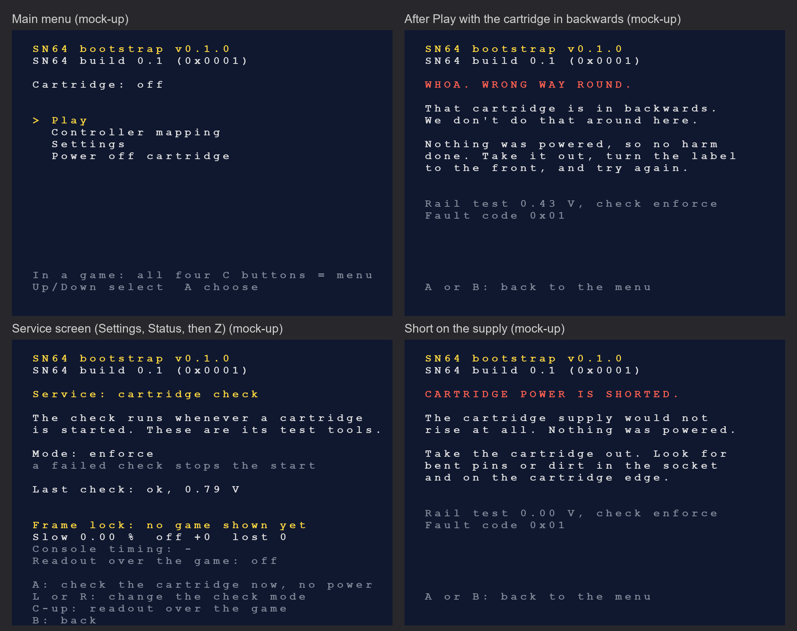

# Cartridge check: detecting a cartridge that is in back to front

**Status (2026-10-01): implemented in the FPGA logic and the boot menu, simulated only. The
thresholds are assumptions. Nothing has been measured on a board or on a cartridge. The check is
not a menu option (owner, 2026-10-01): it runs whenever a cartridge is started and a cartridge
that fails is not powered. Until real cartridges have been measured, that means a wrong threshold
would refuse good cartridges; the service screen is the way out (see "Modes").**

Owner idea, 2026-10-01: "maybe we can have a detection circuit built into the fpga? If it detects
the cart in backwards a message displays stating something quippy but serious enough about what
we dont do around here." Follow-ups the same day: it has to be testable in real life without false
alarms blocking games, hence the modes below; and it is not to be an option on the menu ("the 2
check things should be hiden and just be there and work upon clicking the start game option").

## Why it matters

The SNES cartridge edge is symmetric: 31 contacts on each face, with the same gaps left and right.
Nothing in the socket stops a cartridge that is turned round. On a console the cartridge shell and
the slot do that. On the SN64 the cap's pocket has to do it, the spec requires it (SN64-10-03,
"mechanically keyed insertion"), and it is still open (see [v2-shell.md](v2-shell.md)). This check
is a second line behind the keying, not a replacement for it.

What a reversed cartridge does electrically was checked on the socket footprint
(`hardware/sn64-v2/libraries/SN64_V2.pretty/SNES_Slot_Console_Straddle.kicad_mod`, all 62 pads):
cartridge contact k lands on socket contact 63 - k.

| Cartridge contact | Lands on socket contact | Result |
|---|---|---|
| 5 and 36 (ground) | 58 and 27 (5 V) | the cartridge's ground is on the 5 V rail |
| 27 and 58 (5 V) | 36 and 5 (ground) | the cartridge's supply is on ground |
| every signal | another signal | address, data and control lines are scrambled |

So switching the cartridge's 5 V on would put the supply across every chip backwards. Each chip
then conducts through the diode between its ground and supply pins. Without the check the board
does this:

| Step | Value | Source |
|---|---|---|
| Switch U12 (TPS2553) goes into current limit | 1.04 A nominal, 0.96 to 1.12 A with R318 = 24.9 k | TI SLVS841F, current-limit equations |
| The switch reports the overload | after 7.5 ms (5 to 10 ms) | SLVS841F, FAULT deglitch |
| The sequencer switches off | on the next clock after the report | `sn64_power_sequencer.sv` |

About one amp backwards through the cartridge for up to 10 ms, and afterwards only a generic
"power fault" on the screen. That may or may not damage a cartridge. It is not something to rely on.

## How the check works

It uses parts that are already on the board. No part, pin or trace was added.

- U6 (TLA2528) measures the cartridge rail `SNES_5V_CART` on channel 3 through R30 (20 k) and R31
  (10 k).
- Every TLA2528 channel can also be a digital output (TI SBAS961A, table 3: registers `PIN_CFG`
  0x05, `GPIO_CFG` 0x07, `GPO_DRIVE_CFG` 0x09, `GPO_VALUE` 0x0B).
- Before the switch is enabled, the FPGA makes channel 3 a push-pull output at 3.3 V. R30 then
  feeds a test current into the switched-off rail: (3.3 V - rail) / 20 k, at most 0.165 mA.
- About every 21 ms the pin goes back to an analog input and the rail is measured. The rail's
  capacitors (C209, C210, C323 and the translator decoupling, 54.4 uF) hold the voltage for the
  half millisecond that takes.
- /RESET is released during the check. Its pull-up R207 (4.7 k) hangs from the cartridge rail, and
  with /RESET pulled low the rail could not rise above 0.63 V whatever is in the socket.

What the rail does under that current:

| In the socket | Rail under the test current | Basis |
|---|---|---|
| Nothing | rises towards 3.3 V | calculated |
| Cartridge the right way round | rises until its chips start to draw the test current | **assumed**: about 0.8 V and up |
| Cartridge back to front | held at one silicon junction, about 0.45 to 0.5 V | **assumed** (diode at 0.15 mA) |
| Short on the cartridge supply | stays near 0 V | calculated |

The check passes after two readings in a row at or above the threshold. It fails if that has not
happened when the timeout ends.

| Setting | Value | Status |
|---|---|---|
| Threshold | 0.65 V on the rail (ADC code 269) | **assumed**, halfway between the two assumed groups |
| Readings needed | 2 in a row | chosen |
| Timeout | 4 s | **assumed**; enough for about 850 uF on the rail at this current |
| Time to pass, empty socket | 0.28 s | simulation with the board's real capacitances |
| Time to pass, cartridge with 22 uF | 0.38 s | same simulation, assumed cartridge |
| Current through a reversed cartridge during the check | 0.14 mA at 0.47 V | same simulation, assumed diode |

## Modes

The mode is written with the start request (mailbox `CONTROL` bits 5:4) and taken when the request
starts.

| Mode | What a failed check does | Use |
|---|---|---|
| 0 enforce | latches fault 0x01; 5 V is never switched on | normal use: what "Play" does (the row was called "Start SNES cartridge" until the menu rework of 2026-10-01) |
| 1 report only | records the result; the cartridge is started anyway | first tests on real hardware: a false alarm cannot block a game |
| 2 off | no check | behaviour before the check existed |
| 3 check only | records the result; 5 V is **not** switched on, pass or fail | measuring cartridges, both ways round, without any risk |

The FPGA resets to enforce and the boot menu asks for **enforce** (`SN64_CHECK_MODE_DEFAULT` in
`firmware/bootstrap/src/main.c`). The other modes are on a service screen that the main menu does
not show: Settings, Status / diagnostics, then Z. There A runs check only and L or R changes the mode until
the console is reset; the main menu then says so in red. The check can also be left out of a build: `SEQ_PROBE_ENABLE = 0` in `sn64_top` (the v1 wrapper, which
has no ADC, is built that way). A build without the check still honours check only by never
powering.

Report only gives no protection: in the simulation a reversed cartridge then gets 1.04 A for 7.5 ms
before the switch's fault flag ends it.

## What the screen says

The main menu has no item for the check. Choosing "Play" shows "Checking the
cartridge..." and then either starts the game or, when the check refuses the cartridge (or the
service screen's check only finds one reversed), shows:

```
WHOA. WRONG WAY ROUND.

That cartridge is in backwards.
We don't do that around here.

Nothing was powered, so no harm
done. Take it out, turn the label
to the front, and try again.
```

A rail that does not rise at all (below 0.145 V, assumed) is reported as a short instead. The
wording is in `firmware/bootstrap/src/sn64_cartcheck.c`.



The picture is a drawing made by `firmware/bootstrap/tools/mock_screens.py` from the texts in the
source, not a capture: the menu has not run on a console or an emulator, and the console's font
looks different.

The menu no longer enters the game display until the cartridge is really running. Before this
change a start that ended in any power fault left the menu waiting for a picture that never came.

## Where it is

| Part | File |
|---|---|
| Test current and rail reading | [fpga/rtl/sn64_rail_monitor.sv](../../fpga/rtl/sn64_rail_monitor.sv) |
| Check states, modes, fault 0x01 | [fpga/rtl/sn64_power_sequencer.sv](../../fpga/rtl/sn64_power_sequencer.sv): states 7 CART CHECK, 8 CHECK END, 9 CHECK HOLD |
| `CONTROL` bits 5:4, `CART_CHECK` register at 0x0A | [fpga/rtl/sn64_n64_endpoint.sv](../../fpga/rtl/sn64_n64_endpoint.sv), [fpga/rtl/sn64_top.sv](../../fpga/rtl/sn64_top.sv) |
| Enabled for the v2 board | [fpga/rtl/sn64_board_top.sv](../../fpga/rtl/sn64_board_top.sv) |
| Menu, screens | [firmware/bootstrap/src/main.c](../../firmware/bootstrap/src/main.c), [sn64_cartcheck.c](../../firmware/bootstrap/src/sn64_cartcheck.c) |

`CART_CHECK` (0x0A, read with `FAULT` as one 32-bit word at 0x08): bit 15 done, bit 14 pass, bits
13:12 mode used, bit 8 this build has the check, bits 7:0 rail reading at 9.67 mV per count. It
stays readable after the request is dropped and is cleared when the next request starts.

## Evidence (simulation only)

| Test | What it shows | Result |
|---|---|---|
| `tb_power_sequencer` | ten cases on the state machine: two readings in a row to pass; enforce faults 0x01 with 5 V never on; report only starts anyway; check only never powers; off skips the check; abort; hardware fault during the check; a monitor that never gives the pin back | PASS |
| `tb_cart_check` | monitor and sequencer against a TLA2528 model and an electrical model of the rail, with the socket empty, a good cartridge, a reversed one and a short | PASS |
| `tb_cart_check +keep_reset` | /RESET left pulled during the check | fails as required: "empty socket failed the check (rail reached 0.625 V)" |
| `tb_cart_check`, `SN64_FAULT_CHECK_IGNORED` | a sequencer that does not enforce a failed check | fails as required: "5 V switched on into a cartridge the check must protect" |
| `tb_n64_endpoint` | check mode in `CONTROL`, `CART_CHECK` at 0x0A, mode back to enforce on host reset | PASS |
| `make test`, `make test-negative` in `firmware/bootstrap` | which screen each result gives; every line fits the screen; a wrong short/backwards level is caught | PASS, 74 checks |
| `route_top.py --top board --speed 8` | the design still fits and meets timing with the check | all five clocks pass; 30.2k LUT4, 13,348 flip-flops (106 more than before), 203 of 208 block RAMs ([v2-board-route.json](../../fpga/reports/v2-board-route.json)) |

`tb_cart_check` result line in the suite (capacitances one fortieth of the board's, timeout scaled
with them):

```
PASS: cartridge check (model, capacitances /40): empty socket passes in 41.7 ms at 2.42 V (level
251), again at once in 46.4 ms; good cartridge passes in 41.4 ms at 0.80 V (level 82); reversed
cartridge held at 0.47 V (level 45), fault 0x01, switch never closed, 0.142 mA peak through the
cartridge; short held at 0.000 V (level 0), fault 0x01; check-only never powers; report-only
then applies 5 V: 1.04 A for 7.5 ms until the switch fault trips; pin analog again after FPGA
reset and after a silent ADC
```

The same test run once with the board's real capacitances and the real 4 s timeout
(`+define+SN64_CHECK_REAL_SCALE`, about five minutes, not part of the suite):

```
PASS: cartridge check (model, capacitances /1): empty socket passes in 281.3 ms at 0.71 V (level
73), again at once in 46.4 ms; good cartridge passes in 380.8 ms at 0.69 V (level 71); reversed
cartridge held at 0.47 V (level 48), fault 0x01, switch never closed, 0.138 mA peak through the
cartridge; short held at 0.000 V (level 0), fault 0x01; check-only never powers; report-only
then applies 5 V: 1.04 A for 7.5 ms until the switch fault trips; pin analog again after FPGA
reset and after a silent ADC
```

The cartridge in that model is an assumption, not a measurement: the right way round it draws
nothing below 0.8 V and then behaves as 150 ohm; back to front it is one silicon junction behind
2 ohm; a short is 1 ohm.

## Not known yet, and what would change

1. **No real cartridge has been measured.** The first job on a real board is check only on every
   cartridge to hand, both ways round, noting the reading: North American, PAL and Super Famicom
   cartridges, ones with a save battery, ones with extra chips, the Super EverDrive X5/X6 and the
   FXPAK Pro. The threshold goes between the two groups. Until that is done the enforced check
   rests on assumptions; if it refuses good cartridges on the first board, switch it to report only
   on the service screen and measure.
2. **The margin may be thin.** In the model the two groups are 0.47 V and 0.80 V around a 0.65 V
   threshold. If real cartridges sit closer, the first fix is more test current by lowering R30 and
   R31 together (values only, for example 4.7 k and 2.4 k for 0.7 mA). The next would be a
   resistor and a diode from a spare FPGA pin, which adds parts and needs the owner's yes.
3. **Large capacitors on a cartridge slow the check.** About 850 uF on the rail is the most that
   passes within 4 s at this current. A flashcart's input capacitance is unknown.
4. **The four translators hang on the same rail.** What they draw at 0.5 to 1.5 V is not in their
   datasheet. If it is more than the test current, an empty socket or a good cartridge would fail.
5. **A cartridge with its own reverse protection** (a diode in series with its supply) reads as
   "not reversed". Its supply is then safe by its own doing, but its signal pins are still on the
   wrong contacts. Only the keying in the pocket covers that.
6. An empty socket passes. The check cannot tell "no cartridge" from "cartridge the right way round".
7. Changing a TLA2528 pin between analog input and output while conversions run follows the
   datasheet's register description but has not been tried on the part.
8. A cartridge swapped while the game runs is not covered. Cartridges are not hot-swappable
   (SN64-08-12).

## Real-life test plan (first board)

The point is to find out whether the check ever calls a good cartridge bad, before it is allowed
to block anything. Nothing in this plan powers a cartridge that is in back to front.

The tools are on the service screen: Settings, Status / diagnostics, then Z.

1. Empty socket: press A on the service screen ("check the cartridge now, no power"). Expected: OK.
   Note the voltage.
2. Each cartridge the right way round: the same. Expected: OK. Note the voltage and how long it took.
3. The same cartridge back to front, if the pocket lets it in: the same, and only that. Expected:
   the wrong-way screen. Note the voltage. Do not start a game with it reversed while the mode is
   report only or off.
4. Play each cartridge the right way round. A good cartridge that gets the wrong-way screen is a
   false alarm: note the voltage, switch the mode to report only with L or R, and carry on. In
   report only the service screen shows "Last check: FAILED" for a game that ran anyway.

| Cartridge | Right way round (V) | Back to front (V) | Time to pass (s) | Notes |
|---|---|---|---|---|
| empty socket | | not applicable | | |
| North American cartridge, no battery | | | | |
| North American cartridge with save battery | | | | |
| PAL or Super Famicom cartridge | | | | |
| cartridge with an extra chip (Super FX, SA-1, DSP) | | | | |
| Super EverDrive X5 or X6 | | | | |
| FXPAK Pro | | | | |

The check has earned its place when every "right way round" reading is clearly above every "back
to front" reading, with the threshold between them, and no game showed a false alarm. If the two
groups touch or overlap, see items 2 to 4 under "Not known yet" before changing anything.

## Datasheets read for this (2026-10-01)

- TI TLA2528, SBAS961A (May 2019, revised April 2020): channel modes, register addresses, output
  drive (0.8 x AVDD at 2 mA), pin limits (AVDD + 0.3 V). The schematic generator's pin table was
  checked against it; its notes cited a different document number and were corrected.
- TI TPS2552/TPS2553, SLVS841F (November 2008, revised August 2016): no discharge on the output
  when disabled, reverse leakage 1 uA maximum, current-limit equations, FAULT deglitch. The pin
  table and the 24.9 k current-limit value were checked against it; the note that cited a different
  document number was corrected.
