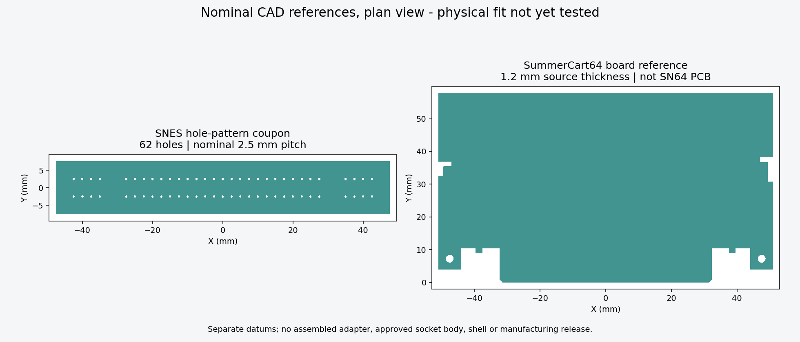

# Mechanical fit references

These are source-backed nominal reference models, not a final SN64 assembly or fabrication package. [Socket selection and open dimensions](../docs/design/socket-selection.md) distinguish supplier evidence from assumptions.

| Model | Editable CAD | Neutral exports | Scope |
|---|---|---|---|
| SNES hole-pattern coupon | [FCStd](fit-references/snes-hole-pattern-coupon.FCStd) | [STEP](fit-references/snes-hole-pattern-coupon.step), [STL](fit-references/snes-hole-pattern-coupon.stl) | 62 nominal Sanni holes; plate margins/thickness are explicit coupon choices |
| N64 source-board reference | [FCStd](fit-references/n64-sc64-board-reference.FCStd) | [STEP](fit-references/n64-sc64-board-reference.step), [STL](fit-references/n64-sc64-board-reference.stl) | SummerCart64 full perimeter, 1.2 mm thickness and two mounting holes; no copper or mating bevel |



## Datums and editable parameters

All values are millimetres. The two documents are **independent references**, not assembled at a common mating datum.

- SNES coupon: X = Sanni footprint Y − 42.5; Y = Sanni footprint X − 2.5. Pin 1 is (−42.5, −2.5), pin 31 is (+42.5, −2.5), pin 32 is (−42.5, +2.5). Z = 0 is the coupon bottom. The native `Parameters` spreadsheet controls the 95 × 15 × 1.6 mm plate and nominal 0.762 mm hole diameter; plate dimensions are design choices and are **not socket dimensions or a selected PCB thickness**. Individual cylinder placements retain the 62 source centres. No housing, mounting ears or solder-tail shape has been invented.
- N64 reference: X = source PCB X − 150; Y = 135.5 − source PCB Y. The origin is the insertion-tip midpoint, Y points toward the board body, and Z = 0 is the bottom face. The source-outline sketch preserves all 35 segments as fixed geometry; the spreadsheet controls extrusion thickness and nominal 2.5 mm mounting-hole diameter. Hole centres are (±47.5, 7.25). Do not treat the entire source board perimeter as SN64's approved outline.

The coupon has nominal holes without printer or fabrication compensation. Inspect its dimensions before using it as a sample jig; small printed holes may need calibrated finishing. A plastic reference does not reproduce contact plating, board stiffness or insertion behavior. Do not force a reference into a connector. Physical measurements and sample tests have not been performed.

## Verification and reproduction

[Validation results](fit-references/validation.json) record FreeCAD 1.1.4, bounds, volumes and file hashes. Both generated bodies are valid single solids; STEP reimport preserves validity/volume, and both STL exports are closed. Both FCStd files were reopened and their thickness parameter temporarily changed to 2 mm: each recomputed to a valid 2 mm body. The temporary changes were not saved. The exported mesh preview was visually inspected. These checks verify the artifacts, not socket or host fit.

From the repository root, using the installed tool versions:

```powershell
& 'C:/Program Files/KiCad/10.0/bin/python.exe' mechanical/extract_source_datums.py --source-root 'C:/Users/RyanB/Documents/Codex/SN 64 Project'
& 'C:/Program Files/FreeCAD 1.1/bin/python.exe' mechanical/build_fit_references.py
& 'C:/Program Files/FreeCAD 1.1/bin/python.exe' mechanical/render_fit_references.py
& 'C:/Program Files/FreeCAD 1.1/bin/python.exe' mechanical/inspect_reference_shells.py --source-root 'C:/Users/RyanB/Documents/Codex/SN 64 Project'
```

`build_fit_references.py` regenerates its named outputs. Preserve manual edits separately before running it. [Source datums](source-datums.json) include pinned source URLs and SHA-256 hashes. [Shell inspection](shell-inspection.json) records the independently imported upstream models; its bounding boxes must not be combined into a supposed assembled-cartridge envelope. Local originals and `downloads/Upstream-shell-references.FCStd` stay ignored in Git.

The extractor verifies both source CAD hashes and revisions against this checkout's `references/source-manifest.json` before parsing or writing. Run `python mechanical/test_source_provenance.py --source-root <reference-project>` with KiCad Python to check authentic inputs and rejection of both modified inputs without overwriting saved datums.

## Attribution and remaining design

The hole-pattern coupon derives its geometry from [Sanni/cartreader](https://github.com/sanni/cartreader/blob/060d8ae0bf4be40bfc6a368bf6fbf7b594b3884d/hardware/footprints/%21OSCR.pretty/SNES%20Slot.kicad_mod), whose hardware notice is [CC-BY-4.0](licenses/Sanni-hardware-CC-BY-4.0.txt). Changes: rotated/centred coordinate system, added parameterized coupon plate and subtracted the source holes. The N64 reference derives from [Polprzewodnikowy/SummerCart64](https://github.com/Polprzewodnikowy/SummerCart64/blob/a1e7996d2cbece686820a5c785029c68514f17b0/hw/pcb/sc64v2.kicad_pcb), with [CERN-OHL-S-2.0 hardware notice](licenses/SummerCart64-PCB-CERN-OHL-S-2.0.txt). Changes: geometry-only extraction, insertion-tip datum, native extrusion/cuts and exports. Neither upstream author endorses SN64 or these changes. Source and editable generation files accompany the derivatives.

[Shell provenance](shell-source-manifest.json) separately records usagi_'s archived [CC-BY-3.0 notice](licenses/usagi-SFC-shell-CC-BY-3.0.txt); that notice is not assigned to other repository files.

Next mechanical work is qualifying the actual socket, selecting the SN64 board/stackup and placements, aligning both hosts' bay/door/eject geometry, and supporting the full cartridge set. Final shell features must include the first-revision side USB-C port and accessible cable path. Enclosure, print material/tolerances, stress/fit tests and PCBWay release remain unfinished.
